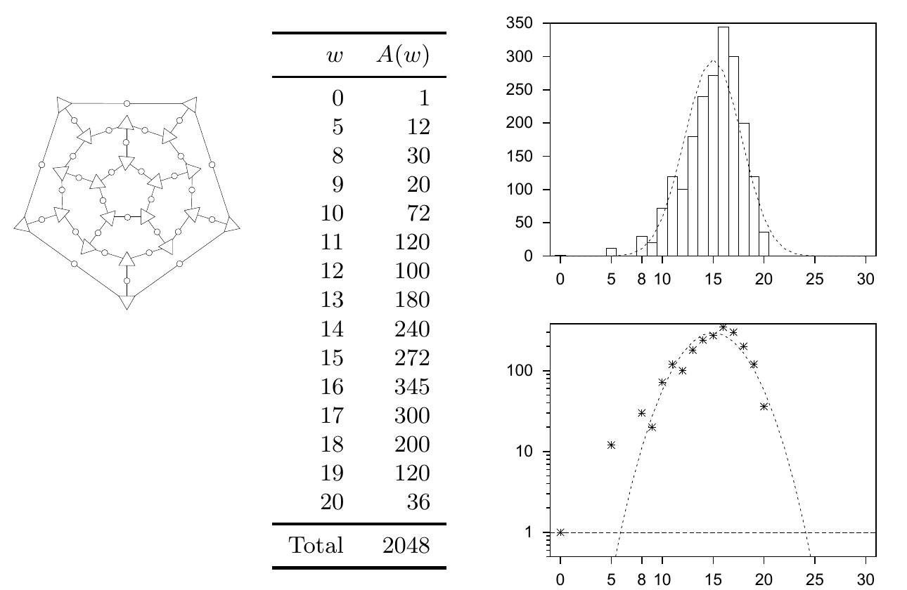
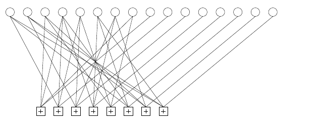

<!-- 源 PDF 物理页 219；原书印刷页 207 -->

图 13.2　定义 $(30,11)$ 十二面体码的图：圆圈是 $30$ 个发送比特，三角形是 $20$ 个奇偶校验约束，其中一个约束冗余。右上图的实线表示该码的重量枚举函数；虚线表示生成矩阵大小相同的全部随机线性码的平均重量枚举函数，稍后将计算它。右下图用对数纵轴表示同样的函数。两幅图的横轴是重量 $w$，上图纵轴为 $A(w)$，下图纵轴为对数刻度的 $A(w)$。

图 13.2 中的重量枚举表逐格译录如下：

| 重量 $w$ | 码字数 $A(w)$ |
| ---: | ---: |
| 0 | 1 |
| 5 | 12 |
| 8 | 30 |
| 9 | 20 |
| 10 | 72 |
| 11 | 120 |
| 12 | 100 |
| 13 | 180 |
| 14 | 240 |
| 15 | 272 |
| 16 | 345 |
| 17 | 300 |
| 18 | 200 |
| 19 | 120 |
| 20 | 36 |
| 合计 | 2048 |

**有界距离译码器**（bounded-distance decoder）：如果接收的二元向量 $\mathbf r$ 与最近码字之间的距离不超过 $t$，就返回该码字；否则返回译码失败。

当差错多于 $t$ 个时不尝试译码，其理由可能是：“我们无法保证纠正多于 $t$ 个差错，何必费力尝试？谁会需要一种能纠正某些重量大于 $t$ 的差错图案、却不能纠正另一些的译码器？”这种认输的态度，就是一种只盯着最坏情形的思维（worst-case-ism）；这是本书想要治愈的一种广泛存在的思维毛病。

✱ 事实上，有界距离译码器达不到二元对称信道的 Shannon 极限；只有经常能够纠正多于 $t$ 个差错的译码器，才可能达到这一极限。当前最好的纠错码译码器，其工作范围远远超出了码的最小距离。

### “好”与“坏”的距离性质如何定义

考虑一族分组长度 $N$ 不断增大、码率趋于某个极限 $R>0$ 的码。我们或许能把这族码归入以下类别之一。这些类别与前文（原书印刷页 183）给“好码”和“坏码”所下的定义有些相似：

**一个码序列具有“好”的距离性质**，如果 $d/N$ 趋于一个大于零的常数。

**一个码序列具有“坏”的距离性质**，如果 $d/N$ 趋于零。

**一个码序列具有“非常坏”的距离性质**，如果 $d$ 趋于一个常数。

图 13.3　一个码率为 $1/2$ 的低密度生成矩阵码的图。最右边的 $M$ 个发送比特各连接到一个不同的奇偶校验约束；最左边的 $K$ 个发送比特各连接到少量奇偶校验约束。图中上方圆圈代表发送比特，下方带加号的方框代表奇偶校验约束。

**例 13.3。** *低密度生成矩阵码*是一种线性码，其 $K\times N$ 生成矩阵 $\mathbf G$ 的每一行都只有少量 $d_0$ 个 `1`，不论 $N$ 有多大。这种码的最小距离至多为 $d_0$，因此低密度生成矩阵码具有“非常坏”的距离性质。

距离大当然不是坏事；但稍后我们会看到，过分强调距离为什么会妨碍我们理解码的实际表现。
