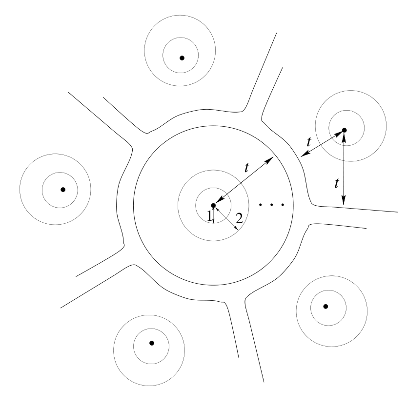

<!-- 源 PDF 物理页 220；原书印刷页 208。 -->

图 13.4　示意图：完美码的各个码字为球心的 $t$ 球，恰好填满 Hamming 空间的一部分。图中黑点代表码字；同心圆和标有 $1$、$2$、$t$ 的箭头表示距码字不同的 Hamming 距离，省略号表示中间距离层；不同 $t$ 球之间既无重叠，也无空隙。

## 13.3　完美码

Hamming 空间中，以一点 $\mathbf x$ 为中心的 *$t$ 球*（或半径为 $t$ 的球），是由所有与 $\mathbf x$ 的 Hamming 距离不超过 $t$ 的点组成的集合。

$(7,4)$ Hamming 码有一个优美的性质：以其 $16$ 个码字为球心，各画一个半径为 $1$ 的球，这些球恰好填满 Hamming 空间，彼此并不重叠。正如第 1 章所见，每个长度为 $7$ 的二元向量，与这个 Hamming 码中恰好一个码字的距离不超过 $t=1$。

如果以一个码的各码字为球心的所有 $t$ 球恰好填满 Hamming 空间，而且彼此没有重叠，就称它为**完美 $t$ 差错纠正码**。（见图 13.4。）

回顾一下这些量：码字数为 $S=2^K$；整个 Hamming 空间中的点数为 $2^N$；半径为 $t$ 的 Hamming 球中的点数为

$$\sum_{w=0}^{t}\binom{N}{w}.\tag{13.1}$$

具有这些参数的码要成为完美码，$S$ 乘以一个 $t$ 球中的点数必须等于 $2^N$：

对于完美码，

$$2^K\sum_{w=0}^{t}\binom{N}{w}=2^N;\tag{13.2}$$

等价地，

$$\sum_{w=0}^{t}\binom{N}{w}=2^{N-K}.\tag{13.3}$$

对于完美码，一个球中的噪声向量数必须等于可能的伴随式（syndrome）数。$(7,4)$ Hamming 码满足这个数值条件，因为

$$1+\binom{7}{1}=2^3.\tag{13.4}$$
