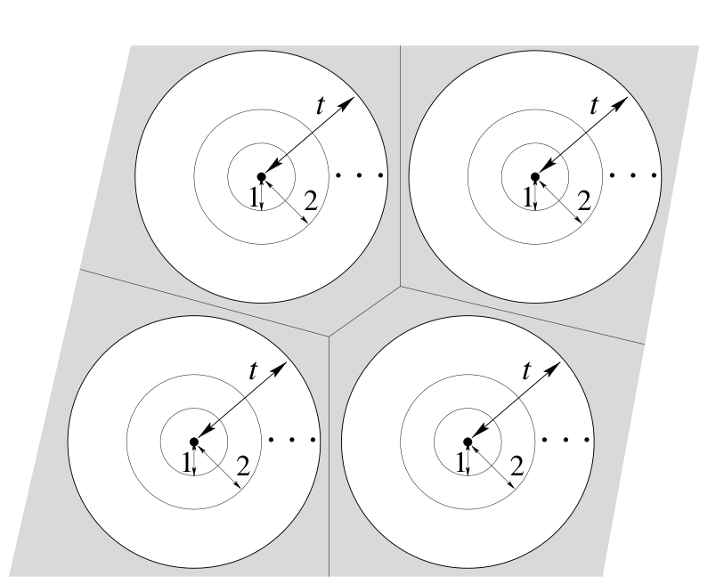

<!-- 源 PDF 物理页 221；原书印刷页 209。 -->

图 13.5　示意图：以一个码的各码字为球心的 $t$ 球，并未恰好填满 Hamming 空间。灰色区域中的点与任何码字的 Hamming 距离都大于 $t$。这幅图容易给人误导：在高维空间中，只要 $t$ 较大，无论是什么码，各球之间的灰色区域几乎占据整个 Hamming 空间。图内黑点、距离 $1$、$2$、$t$ 和省略号的含义与图 13.4 相同。

### 多么希望有完美码可用

如果有大量不同分组长度、不同码率的完美码可供选择，它们就能完美地解决 Shannon 提出的问题。例如，要在噪声水平为 $f$ 的二元对称信道上通信，可以选取分组长度为 $N$、能纠正 $t$ 个差错的完美码，其中 $t=f^*N$、$f^*=f+\delta$，并选择 $N$ 和 $\delta$，使噪声翻转超过 $t$ 位的概率小到令人满意。

✱ **然而，完美码几乎不存在。** 非平凡的二元完美码只有：

1. **Hamming 码**：它们是 $t=1$、分组长度 $N=2^M-1$ 的完美码，将在下文定义。随着分组长度 $N$ 增大，Hamming 码的码率趋近于 $1$；
2. **奇数分组长度 $N$ 的重复码**：它们是 $t=(N-1)/2$ 的完美码；其码率像 $1/N$ 那样趋于零；
3. **二元 Golay 码**：这是一种非凡的、能纠正 $3$ 个差错的码，有 $2^{12}$ 个码字，分组长度 $N=23$。［第二种 Golay 码使用三元字符表，长度为 $N=11$，能纠正 $2$ 个差错；1947 年，芬兰的一位足球博彩爱好者 Juhani Virtakallio 发现了它。］

此外再无二元完美码。为什么完美码如此稀少？Hamming 码的参数满足式 (13.4)，Golay 码的参数则满足

$$1+\binom{23}{1}+\binom{23}{2}+\binom{23}{3}=2^{11},\tag{13.5}$$

是不是因为这样精确的数值巧合很罕见？是否存在大量“近乎完美”的码，它们的 $t$ 球几乎填满整个空间？

没有。事实上，图 13.5 那种以各码字为球心的 Hamming 球几乎填满空间的画法，会造成误导。对大多数码来说，无论它们是好码还是坏码，Hamming 空间的绝大部分都位于各 $t$ 球之间的区域，即图 13.5 中的灰色部分。

确立了这幅不太乐观的图景后，我们先花一点时间补充前面提到的完美码的性质。
