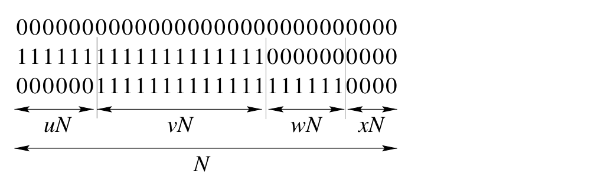

<!-- 源 PDF 物理页 222；原书印刷页 210。末段跨至 PDF 223 页首，条件与推论在前后两页顺接。 -->

图 13.6　三个码字。图中按总长 $N$ 把坐标分成长度分别为 $uN$、$vN$、$wN$、$xN$ 的四段；三行二元数字给出三个码字在各段的取值。第一个码字全为零，另外两个码字与它及彼此的距离由 $u$、$v$、$w$ 决定；标记均为数学符号，无英文图内文字。

### Hamming 码

$(7,4)$ Hamming 码可以定义为一个线性码：其 $3\times7$ 奇偶校验矩阵的各列，恰好是全部 $7(=2^3-1)$ 个长度为 $3$ 的非零向量。由于这 $7$ 个向量各不相同，翻转任何一位都会产生不同的伴随式，因此所有单比特差错都能被检测并纠正。

这一取 $M=3$ 个奇偶校验约束的码，可以推广如下。选定奇偶校验约束数 $M$ 后，Hamming 码便是一种单差错纠正码：分组长度 $N=2^M-1$，奇偶校验矩阵的各列为全部 $N$ 个长度为 $M$ 位的非零向量。

前几种 Hamming 码的码率如下：

| 校验约束数 $M$ | $(N,K)$ | 码率 $R=K/N$ | 说明 |
| ---: | :---: | :---: | :--- |
| 2 | $(3,1)$ | $1/3$ | 重复码 $R_3$ |
| 3 | $(7,4)$ | $4/7$ | $(7,4)$ Hamming 码 |
| 4 | $(15,11)$ | $11/15$ |  |
| 5 | $(31,26)$ | $26/31$ |  |
| 6 | $(63,57)$ | $57/63$ |  |

 **习题 13.4**〔难度 2；解答见原书印刷页 223〕$(N,K)$ Hamming 码用于噪声密度为 $f$ 的二元对称信道时，分组差错概率的主导阶是多少？

## 13.4　完美性无法达到：第一个证明

我们将用几种方法表明，有用的完美码不存在。这里“有用”是指分组长度 $N$ 很大，且码率既不接近 $0$，也不接近 $1$。

Shannon 证明：对噪声水平为任意 $f$ 的二元对称信道，存在分组长度 $N$ 很大、码率任意接近 $C(f)=1-H_2(f)$ 的码，使通信的差错概率任意小。对于很大的 $N$，每个分组中通常约有 $fN$ 位出错，因此 Shannon 的这些码“几乎总能纠正 $fN$ 个差错”。

来看一个特殊情况：噪声信道满足 $f\in(1/3,1/2)$。能否找到一种大分组长度的完美码，纠正 $fN$ 个差错？假设已经找到这样一个码，只考察其中三个码字。（请记住，该码的码率应为 $R\simeq1-H_2(f)$，因而应有极多码字，数量为 $2^{NR}$。）不失一般性，取其中一个码字为全零码字，并使另两个码字与它的重叠关系如图 13.6 所示。第二个码字与第一个码字在占比为 $u+v$ 的坐标上不同；第三个码字与第一个在占比为 $v+w$ 的坐标上不同，与第二个在占比为 $u+w$ 的坐标上不同；占比为 $x$ 的坐标在三个码字中均为零。如果该码能纠正 $fN$ 个差错，它的最小距离就必须大于 $2fN$，因此
