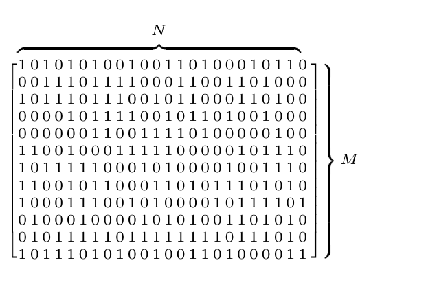

<!-- 源 PDF 物理页 223；原书印刷页 211。页首承接 PDF 222 末段；源页右侧图 13.7 随本页正文保留。 -->

$$u+v>2f,\qquad v+w>2f,\qquad u+w>2f.\tag{13.6}$$

把这三个不等式相加，再除以二，得到

$$u+v+w>3f.\tag{13.7}$$

所以，如果 $f>1/3$，便可推出 $u+v+w>1$，从而 $x<0$；这是不可能的。这样的码根本不存在：它连三个码字都不可能有，更不用说有 $2^{NR}$ 个码字了。

由此可见，尽管 Shannon 证明了二元对称信道在 $f>1/3$ 时仍有大量可用于通信的码，却不存在能做到这一点的完美码。

下面研究一个更一般的论证，它表明：在一般的码率下（不包括 $0$ 和 $1$），不存在大型的完美线性码。为此，我们要找出随机线性码的典型距离。

图 13.7　一个随机二元奇偶校验矩阵。图内的 $M$ 标在行方向，$N$ 标在列方向，表示矩阵有 $M$ 行、$N$ 列；每个元素是二元数字。

## 13.5　随机线性码的重量枚举函数

设想随机选取 $M\times N$ 奇偶校验矩阵 $\mathbf H$ 的各个二元元素，以构造一个码。我们应当预期得到怎样的重量枚举函数？

某个特定码的奇偶校验矩阵为 $\mathbf H$，其重量枚举函数 $A(w)_{\mathbf H}$ 是重量为 $w$ 的码字数，可写作

$$A(w)_{\mathbf H}=\sum_{\mathbf x:|\mathbf x|=w}\mathbb{1}[\mathbf H\mathbf x=0],\tag{13.8}$$

其中求和遍及所有重量为 $w$ 的向量 $\mathbf x$；真值函数 $\mathbb{1}[\mathbf H\mathbf x=0]$ 在 $\mathbf H\mathbf x=0$ 时等于 $1$，否则等于 $0$。

我们可以求出 $A(w)$ 的期望值：

$$\langle A(w)\rangle=\sum_{\mathbf H}P(\mathbf H)A(w)_{\mathbf H},\tag{13.9}$$

$$=\sum_{\mathbf x:|\mathbf x|=w}\sum_{\mathbf H}P(\mathbf H)\mathbb{1}[\mathbf H\mathbf x=0],\tag{13.10}$$

办法是计算重量为 $w>0$ 的一个特定向量成为该码码字的概率，这里对我们这类码中的所有二元线性码取平均。由对称性可知，这个概率只取决于向量的重量 $w$，与向量的具体取值无关。整个伴随式 $\mathbf H\mathbf x$ 为零的概率，可以把伴随式中 $M$ 个比特各自为零的概率相乘求出。伴随式中的每一位 $z_m$ 都是 $w$ 个随机比特按模 $2$ 相加，因此 $z_m=0$ 的概率是 $1/2$。于是，$\mathbf H\mathbf x=0$ 的概率为

$$\sum_{\mathbf H}P(\mathbf H)\mathbb{1}[\mathbf H\mathbf x=0]=(1/2)^M=2^{-M},\tag{13.11}$$

与 $w$ 无关。

要得到重量为 $w$ 的码字的期望数，即式 (13.10)，对所有重量为 $w$ 的向量，把每个向量成为码字的概率相加即可。这样的向量有 $\binom Nw$ 个，所以

$$\langle A(w)\rangle=\binom Nw 2^{-M}\quad\text{对任意 }w>0.\tag{13.12}$$
