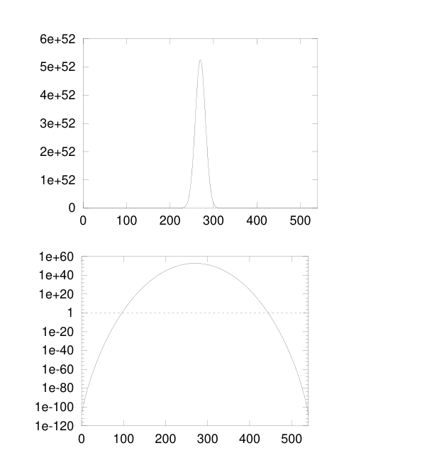
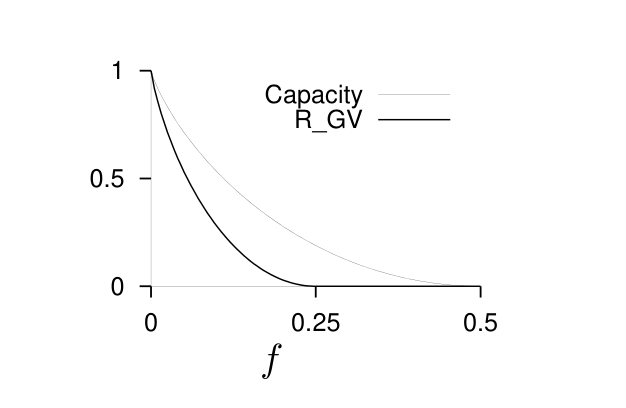

<!-- 源 PDF 物理页 224；原书印刷页 212。 -->

当 $N$ 很大时，可用 $\log_2\binom Nw\simeq NH_2(w/N)$ 及 $R\simeq1-M/N$，把上式写成

$$\log_2\langle A(w)\rangle\simeq NH_2(w/N)-M,\tag{13.13}$$

$$\simeq N[H_2(w/N)-(1-R)]\quad\text{对任意 }w>0.\tag{13.14}$$

举一个具体例子：图 13.8 给出了一个码率为 $1/3$、$N=540$、$M=360$ 的随机线性码的期望重量枚举函数。

图 13.8　一个 $N=540$、$M=360$ 的随机线性码的期望重量枚举函数 $\langle A(w)\rangle$。上图采用普通纵轴，下图采用对数纵轴；两图横轴均为重量 $w$（刻度从 $0$ 至约 $540$）。图中没有英文标注。

### Gilbert–Varshamov 距离

当重量 $w$ 满足 $H_2(w/N)<(1-R)$ 时，$A(w)$ 的期望值小于 $1$；当 $H_2(w/N)>(1-R)$ 时，期望值大于 $1$。因此可以预期：当 $N$ 很大时，随机线性码的最小距离接近由下式定义的距离 $d_{\rm GV}$：

$$H_2(d_{\rm GV}/N)=(1-R).\tag{13.15}$$

**定义。** 对码率为 $R$、分组长度为 $N$ 的码，距离 $d_{\rm GV}\equiv NH_2^{-1}(1-R)$ 称为 *Gilbert–Varshamov 距离*。

广受认可的 *Gilbert–Varshamov 猜想*认为：当 $N$ 很大时，不可能造出最小距离显著大于 $d_{\rm GV}$ 的二元码。

**定义。** 若 Gilbert–Varshamov 猜想成立，*Gilbert–Varshamov 码率* $R_{\rm GV}$ 是使用有界距离译码器（定义见原书印刷页 207）实现可靠通信所能达到的最高码率。

图 13.9　Shannon 信道容量 $C$ 与 Gilbert 码率 $R_{\rm GV}$ 的比较。$R_{\rm GV}$ 是使用有界距离译码器所能达到的最高通信码率；两条曲线都以噪声水平 $f$ 为横轴。对任意给定码率 $R$，Shannon 理论允许的最大噪声水平，是使用有界距离译码器的“只看最坏情形者”所能承受水平的两倍。图内图例 `Capacity` 意为“容量”，`R_GV` 为 Gilbert–Varshamov 码率；纵轴从 $0$ 到 $1$，横轴 $f$ 从 $0$ 到 $0.5$。

### 为什么球体装填不是恰当的视角，执着于距离也不合适

如果使用有界距离译码器，所能容忍的最大噪声水平会使占比为 $f_{\rm bd}=\tfrac12d_{\min}/N$ 的比特翻转。因此，若假定 $d_{\min}$ 等于式 (13.15) 的 Gilbert 距离 $d_{\rm GV}$，就有

$$H_2(2f_{\rm bd})=(1-R_{\rm GV}),\tag{13.16}$$

$$R_{\rm GV}=1-H_2(2f_{\rm bd}).\tag{13.17}$$

现在来看关键所在：Shannon 证明什么是可达到的？他说最大可能通信码率就是信道容量，

$$C=1-H_2(f).\tag{13.18}$$

所以，对于给定码率 $R$，按 Shannon 理论可容忍的最大噪声水平满足

$$H_2(f)=(1-R).\tag{13.19}$$

结论是：设已选定一个码率为 $R$ 的好码；式 (13.16) 和 (13.19) 分别定义了有界距离译码器与 Shannon 译码器所能容忍的最大噪声水平 $f_{\rm bd}$ 和 $f$，因此

$$f_{\rm bd}=f/2.\tag{13.20}$$

有界距离译码器永远只能应付 Shannon 已证明可以容忍的噪声水平的一半！

这与完美码有什么关系？如果码字周围的 $t$ 球恰好填满 Hamming 空间而没有重叠，这个码就是完美码。
