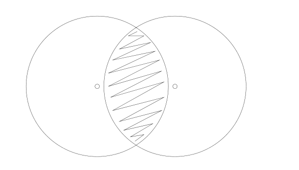
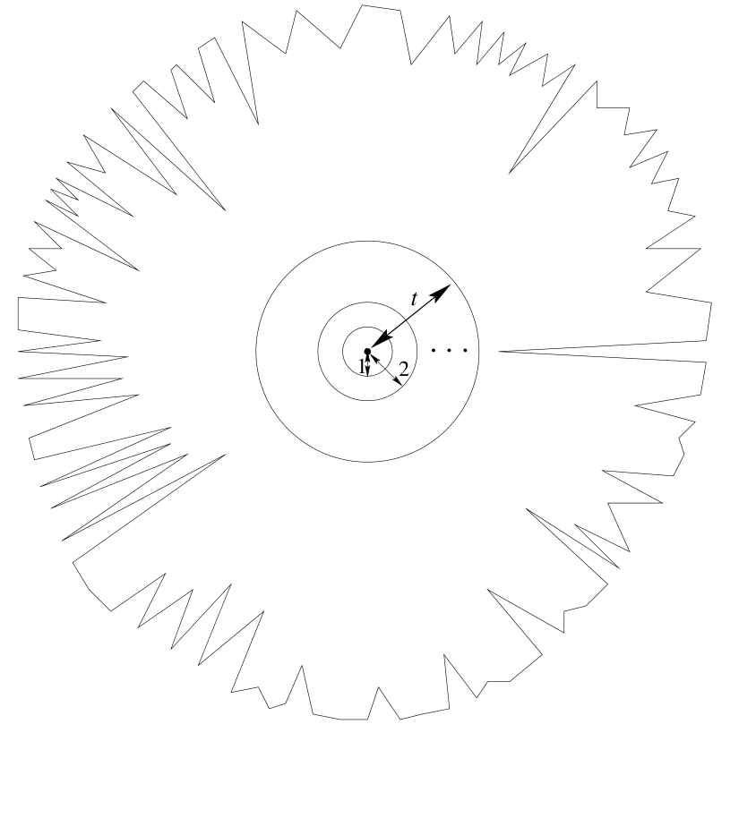

<!-- 源 PDF 物理页 225；原书印刷页 213。 -->

图 13.10　两个相互重叠的球，球的半径几乎等于两球心之间的距离。两球交叠的区域以斜线标出；图内没有英文文字。

但是，当典型的随机线性码被用在接近 Shannon 极限的二元对称信道上时，通常有约 $fN$ 位被翻转，码字间的最小距离也约为 $fN$；若信道条件略好于 Shannon 极限，最小距离会稍大一点。因此，以码字为球心的 $fN$ 球彼此重叠得相当多，每个球几乎都包含距离最近的另一个球的球心！这种重叠之所以没有造成灾难，是因为在高维空间中，图 13.10 的阴影所示的交叠区域只占任一球体积的很小一部分，所以落到该区域的概率极低。

这个故事说明，只盯最坏情形会使可容忍的噪声水平减半。要达到 Shannon 极限，必须能译出超出码的最小距离所保证范围许多的接收向量！

尽管如此，码的最小距离在实践中仍值得关注，因为在某些条件下，它会主导这个码的差错表现。

## 13.6　Berlekamp 的蝙蝠

一只盲蝙蝠住在洞穴里。它围绕洞穴中心飞行，而洞穴中心对应于一个码字；它通常离中心多远，由活跃程度参数 $f$ 控制。（蝙蝠离中心的位移对应噪声向量。）洞穴的边界由指向洞穴中心的钟乳石形成（图 13.11）。每根钟乳石相当于本码字与另一个码字之间的分界。钟乳石类似图 13.10 的阴影区域，只是改变了形状，以便表达它是体积极小的区域。

译码错误对应于蝙蝠本来要走的轨迹进入一根钟乳石内部。它可能撞上离洞穴中心距离各不相同的钟乳石。

如果活跃程度很低，蝙蝠通常非常靠近洞穴中心；碰撞很少发生。发生时，通常会撞上尖端最靠近中心的那些钟乳石。类似地，在低噪声条件下，译码错误很少见，发生时通常涉及低重量码字。此时，码的最小距离与极小的差错概率有关。

图 13.11　Berlekamp 对一个码字附近 Hamming 空间的示意图。锯齿状实线围住所有与这个码字距离最近的点；以它为中心的 $t$ 球只占这一区域的一小部分。图内黑点表示码字，标有 $1$、$2$、$t$ 的箭头表示距离层，省略号表示中间层。
