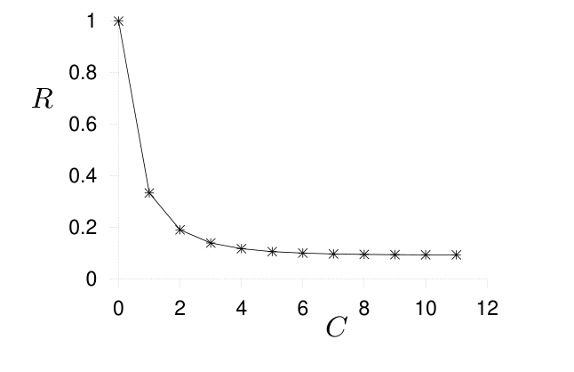
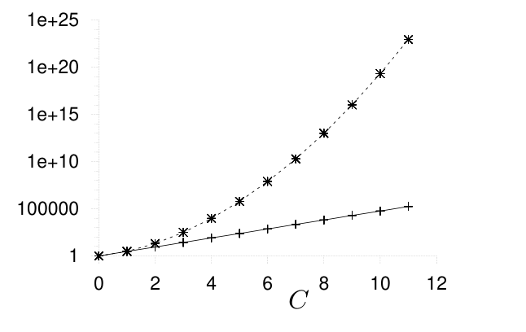

<!-- 源 PDF 物理页 226；原书印刷页 214。末段从图 13.14 的说明续至 PDF 227 页首，此处合为原书同一段。 -->

如果蝙蝠更活跃，它可能经常飞到安全距离 $t$ 之外，也就是最长的钟乳石开始伸入的地方；但由于较远处的钟乳石数量更多，它最常撞上的反而是那些更远的钟乳石。处于最小距离处的钟乳石只有极少几根，因此相对不容易造成差错。类似地，实际纠错码的差错取决于重量枚举函数的性质。

如果活跃程度极高，蝙蝠总是离洞穴中心很远，几乎所有碰撞都发生在远处的钟乳石上。此时，碰撞频率与洞穴中心到最近一根钟乳石的距离毫无关系。

## 13.7　Hamming 码的串接

值得继续研究 Hamming 码的串接。我们最初在图 11.6 中接触这一概念；它能帮助我们理解什么是好码，以及码的最小距离何时重要、何时不重要。

对于噪声密度为 $f$ 的二元对称信道，可以依次使用几种 Hamming 码进行编码，得到一个串接码。

下表回顾了 Hamming 码的主要性质，以校验约束数 $M$ 为索引。所有 Hamming 码的最小距离均为 $d=3$，在长度为 $N$ 的分组中都能纠正一个差错。

| 性质 | 含义 |
| :--- | :--- |
| $N=2^M-1$ | 分组长度 |
| $K=N-M$ | 信源比特数 |
| $p_{\rm B}=\dfrac{3}{N}\binom{N}{2}f^2$ | 分组差错概率的主导阶 |

如果把 $C$ 个 $M$ 逐渐增大的 Hamming 码串接成乘积码，可以适当地选取参数 $\{M_c\}_{c=1}^{C}$，使乘积码的码率

$$R_C=\prod_{c=1}^{C}\frac{N_c-M_c}{N_c}\tag{13.21}$$

在 $C$ 增大时趋于一个非零极限。例如，取 $M_1=2$、$M_2=3$、$M_3=4$，以此类推，则渐近码率为 $0.093$（图 13.12）。

图 13.12　串接 Hamming 码的码率 $R$ 与串接次数 $C$ 的关系。图内横轴标为 $C$，纵轴标为 $R$；曲线随 $C$ 增大趋近约 $0.093$。

分组长度 $N$ 随 $C$ 迅速增长，因此这些码不太实用。它们还有一个弱点：最小距离表现不够好（图 13.13）。每个组成它们的 Hamming 码的最小距离都是 $3$，所以第 $C$ 个乘积码的最小距离是 $3^C$。但分组长度 $N$ 的增长快于 $3^C$，因此 $C$ 增大时 $d/N$ 趋于零。相比之下，对典型随机码，$d/N$ 趋于满足 $H_2(d/N)=1-R$ 的一个常数。所以，串接的 Hamming 码具有“坏”的距离性质。

图 13.13　串接 Hamming 码的分组长度 $N_C$（上方曲线）及最小距离 $d_C$（下方曲线），随串接次数 $C$ 的变化。图内横轴为 $C$，纵轴采用对数刻度，刻度从 $1$ 延伸至 $10^{25}$。

尽管如此，这一简单的码序列对某些信道确实能形成好码，不过还不是非常好的码（“好”与“非常好”的定义见第 11.4 节）。我们不在此证明，而只用数值结果来考察它。

图 13.14 给出了串接码的比特差错概率 $p_b$，假定各组成码像第 11.4 节所述的那样依次译码。［正如该节所见，这种一次只译一个码的办法并非最优。］横轴表示各码的码率。随着串接次数增加，码率降至 $0.093$，差错概率趋于零。图中假定的信道是 $f=0.0588$ 的二元对称信道；这是这种串接码所能容忍的最高噪声水平。
