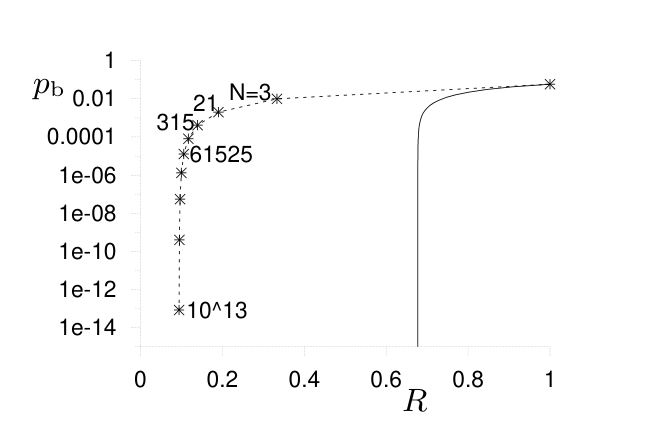
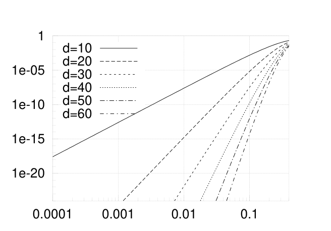

<!-- 源 PDF 物理页 227；原书印刷页 215。页首承接 PDF 226 的图 13.14 讨论，该段已在前页合为原书同一段。 -->

图 13.14　二元对称信道噪声水平为 $f=0.0588$ 时，串接 Hamming 码的比特差错概率 $p_b$ 与码率 $R$ 的关系。各数据点旁的数字表示分组长度 $N$，图中的 `N=3`、`21`、`315`、`61525` 和 `10^13` 都是相应的长度标记；实线表示该信道的 Shannon 极限。$R$ 趋于 $0.093$ 时，比特差错概率趋于零，所以这一系列串接 Hamming 码是一个“好”码族。

这个故事的要点是：*距离并非全部*。编码理论家虽然十分推崇码的最小距离，但对于 Shannon 要实现的目标——在有噪声信道上可靠通信——它并非具有根本重要性。

▷ **习题 13.5**〔难度 3〕证明：存在距离性质“坏”、却是“非常好”的码族。

## 13.8　距离并非全部

以二元对称信道为例，我们来定量地了解码的最小距离究竟会产生什么影响。

### 一个低重量码字所对应的差错概率

设一个二元码的分组长度为 $N$，只有两个码字，二者在 $d$ 个位置上不同。为简单起见，假定 $d$ 是偶数。若在噪声水平为 $f$ 的二元对称信道上使用这个码，差错概率是多少？

只有两个码字不同的位置上的比特翻转才重要。差错概率主要由这 $d$ 位中有 $d/2$ 位翻转的概率决定。其他位置发生什么并不重要，因为最优译码器会忽略它们。

$$P(\text{分组差错})\simeq\binom{d}{d/2}f^{d/2}(1-f)^{d/2}.\tag{13.22}$$

图 13.15 画出了一个重量为 $d$ 的码字所对应的这一差错概率。再利用式 (1.16) 对二项式系数的近似，可进一步得到

$$P(\text{分组差错})\simeq\left[2f^{1/2}(1-f)^{1/2}\right]^d,\tag{13.23}$$

$$\equiv[\beta(f)]^d,\tag{13.24}$$

其中 $\beta(f)=2f^{1/2}(1-f)^{1/2}$ 称为该信道的 *Bhattacharyya 参数*。

图 13.15　与单个重量为 $d$ 的码字对应的差错概率 $\binom{d}{d/2}f^{d/2}(1-f)^{d/2}$，作为噪声水平 $f$ 的函数。图例中的 `d=10`、`d=20`、`d=30`、`d=40`、`d=50`、`d=60` 表示六条曲线的码字重量；横轴和纵轴都采用对数刻度。

现在考虑距离为 $d$ 的一般线性码。不论分组长度 $N$ 如何，它的分组差错概率都至少是 $\binom{d}{d/2}f^{d/2}(1-f)^{d/2}$。因此，在任意二元对称信道上，若一族码的分组长度 $N$ 不断增大，而距离 $d$ 固定不变（即距离性质“非常坏”），其分组差错概率就不可能趋于零。如果希望构造差错概率极其微小的优秀纠错码，我们或许因此想避开距离性质“坏”的码。不过，从实际用途出发，应更仔细地看图 13.15。第 1 章论证过，磁盘驱动器所用的码需要把差错概率降到约 $10^{-18}$ 以下。如果磁盘的原始差错概率约为 $0.001$，距离 $d=20$ 的一个码字所对应的差错概率小于 $10^{-24}$；如果原始差错概率约为 $0.01$，距离 $d=30$ 的一个码字所对应的差错概率小于 $10^{-20}$。所以在实践中，码并不一定非要有好的距离性质。举例说，某些分组长度为 $10{,}000$ 的码，已知有许多重量为 $32$ 的码字，但仍能以极小的差错概率纠正重量为 $320$ 的差错。
