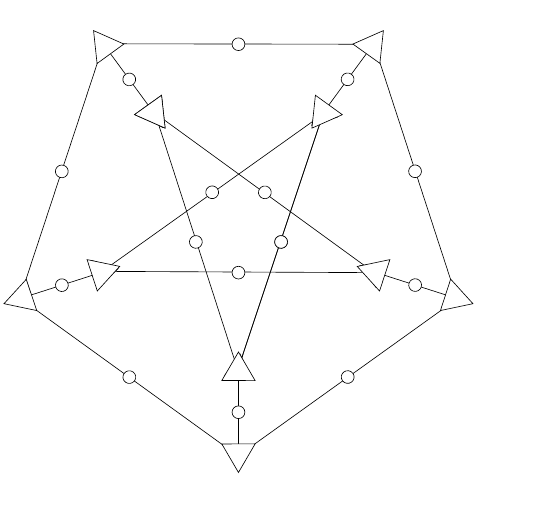

<!-- 源 PDF 物理页 233；原书印刷页 221。页首续习题 13.14。 -->

考虑这两个译码问题各自的最优译码器。请证明最优逐位译码器的错误概率与最优码字译码器的错误概率密切相关，方法是证明下述定理。

**定理 13.1。** *如果一个二元线性码的最小距离为 $d_{\min}$，那么对于任意给定信道，最优逐位译码器的码字比特错误概率 $p_b$，与最大似然译码器的分组错误概率 $p_B$ 满足：*

$$p_B\geq p_b\geq\frac{1}{2}\frac{d_{\min}}{N}p_B.\tag{13.39}$$

 **习题 13.15**〔难度 1〕$(15,11)$ Hamming 码和 $(31,26)$ Hamming 码的最小距离分别是多少？

▷ **习题 13.16**〔难度 2〕设 $A(w)$ 是码率为 $1/3$、$N=540$、$M=360$ 的随机线性码的平均重量枚举函数。请从基本原理出发，估计 $w=1$ 时的 $A(w)$。

**习题 13.17**〔难度 3C〕**最小距离大于 $d_{\mathrm{GV}}$ 的码。** 一个相当不错的 $(15,5)$ 码由下面的生成矩阵给出。它以测量源比特的全部 $\binom{5}{3}=10$ 个三比特组合的奇偶校验值为基础：

$$\mathbf G=\begin{bmatrix}1&\cdot&\cdot&\cdot&\cdot&\cdot&1&1&1&\cdot&\cdot&1&1&\cdot&1\\\cdot&1&\cdot&\cdot&\cdot&\cdot&\cdot&1&1&1&1&\cdot&1&1&\cdot\\\cdot&\cdot&1&\cdot&\cdot&1&\cdot&\cdot&1&1&\cdot&1&\cdot&1&1\\\cdot&\cdot&\cdot&1&\cdot&1&1&\cdot&\cdot&1&1&\cdot&1&\cdot&1\\\cdot&\cdot&\cdot&\cdot&1&1&1&1&\cdot&\cdot&1&1&\cdot&1&\cdot\end{bmatrix}.\tag{13.40}$$

求这个码的最小距离和重量枚举函数。

**习题 13.18**〔难度 3C〕求“富含五边形的”（pentagonful）低密度奇偶校验码的最小距离；其奇偶校验矩阵为

$$\mathbf H=\left[\begin{array}{ccccc|ccccc|ccccc}1&\cdot&\cdot&\cdot&1&1&\cdot&\cdot&\cdot&\cdot&\cdot&\cdot&\cdot&\cdot&\cdot\\1&1&\cdot&\cdot&\cdot&\cdot&1&\cdot&\cdot&\cdot&\cdot&\cdot&\cdot&\cdot&\cdot\\\cdot&1&1&\cdot&\cdot&\cdot&\cdot&1&\cdot&\cdot&\cdot&\cdot&\cdot&\cdot&\cdot\\\cdot&\cdot&1&1&\cdot&\cdot&\cdot&\cdot&1&\cdot&\cdot&\cdot&\cdot&\cdot&\cdot\\\cdot&\cdot&\cdot&1&1&\cdot&\cdot&\cdot&\cdot&1&\cdot&\cdot&\cdot&\cdot&\cdot\\\hline \cdot&\cdot&\cdot&\cdot&\cdot&1&\cdot&\cdot&\cdot&\cdot&1&\cdot&\cdot&\cdot&1\\\cdot&\cdot&\cdot&\cdot&\cdot&\cdot&\cdot&\cdot&1&\cdot&1&1&\cdot&\cdot&\cdot\\\cdot&\cdot&\cdot&\cdot&\cdot&\cdot&1&\cdot&\cdot&\cdot&\cdot&1&1&\cdot&\cdot\\\cdot&\cdot&\cdot&\cdot&\cdot&\cdot&\cdot&\cdot&\cdot&1&\cdot&\cdot&1&1&\cdot\\\cdot&\cdot&\cdot&\cdot&\cdot&\cdot&\cdot&1&\cdot&\cdot&\cdot&\cdot&\cdot&1&1\end{array}\right].\tag{13.41}$$

图 13.17　富含五边形的低密度奇偶校验码的图。图中有 $15$ 个比特节点（圆圈）和 $10$ 个奇偶校验节点（三角形）。［此图称为 Petersen 图。］

证明十行中有九行线性无关，因此此码的参数为 $N=15$、$K=6$。使用计算机求出它的重量枚举函数。

▷ **习题 13.19**〔难度 3C〕重现生成图 13.12 时所用的计算。核实可纠正的最高噪声水平为 $0.0588$ 的说法。尝试其他级联码序列。你能否找到一个更好的级联码序列——即其渐近码率 $R$ 更高，或者能容忍更高的噪声水平 $f$？
