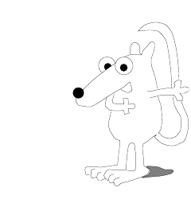

<!-- 源 PDF 物理页 234；原书印刷页 222。习题 13.24 的题干与提示续至 PDF 235 页首，此处合为完整一题。 -->

 **习题 13.20**〔难度 3；解答见原书印刷页 226〕利用下面的计数论证，研究线性分组码能否达到 Shannon 极限。设一个线性码的分组长度 $N$ 很大，码率 $R=K/N$。它的奇偶校验矩阵 $\mathbf H$ 有 $M=N-K$ 行。假定该码的最优译码器通过求解伴随式译码问题 $\mathbf H\mathbf n=\mathbf z$，能在比特翻转概率为 $f$ 的二元对称信道上实现可靠通信。

“典型”噪声向量 $\mathbf n$ 有多少个？

不同的伴随式 $\mathbf z$ 大约有多少个？

既然最优译码器能从 $\mathbf z$ 可靠地推断 $\mathbf n$，伴随式的数量就必须大于或等于典型噪声向量的数量。对于给定的 $f$，这说明码率 $R$ 的最大可能值是多少？

▷ **习题 13.21**〔难度 2〕二元线性码以相同概率使用输入符号 $0$ 和 $1$，暗中把信道当作对称信道。如果实际信道高度不对称，这一假设会使通信码率损失多少？以 Z 信道为例：使用对称输入时可达到的最高通信码率，比信道容量低多少？［答案：约 $6\%$。］

**习题 13.22**〔难度 2〕证明：按第 11.4 节（原书印刷页 183）的定义，距离性质“非常坏”的码是“坏”码。

**习题 13.23**〔难度 3〕可以通过*删余*（puncturing）从一个线性码得到另一个线性码。删余是指从每个码字中删去一组事先指定的比特；它把一个 $(N,K)$ 码变成一个 $(N',K)$ 码，其中 $N'<N$。

另一种由旧线性码构造新码的办法是*缩短*（shortening）。缩短是指约束一组事先指定的比特为零，然后把它们从码字中删去。通常，若缩短一位，码的一半码字会消失。缩短通常把一个 $(N,K)$ 码变成 $(N',K')$ 码，其中 $N-N'=K-K'$。

还可以对两个旧码取*交集*来构造新线性码：只有同时属于两个旧码的码字才保留在新码里。

讨论删余、缩短与取交集分别怎样影响码的距离性质。这三种操作中的每一种，能否把距离性质“坏”的码族变成距离性质“好”的码族，*或反过来*？

**习题 13.24**〔难度 3；解答见原书印刷页 226〕**Todd Ebert 的帽子谜题。**

三名玩家走进一间屋子，每人头上被戴上一顶红帽或蓝帽。每顶帽子的颜色由一次掷硬币决定，各次掷币的结果互不影响。每个人都能看到另外两人的帽子，却看不到自己的。

除了进入屋子前可以先开一次策略会议，玩家之间不得以任何方式交流。看过其他人的帽子后，三人必须同时猜测自己帽子的颜色，或选择不猜。只要*至少一人猜对，而且无人猜错*，小组就平分 $300$ 万美元奖金。

同样的游戏可以由任意人数参加。一般问题是：为小组找出使获奖概率最大的策略。请分别找出**三人**小组和**七人**小组的最佳策略。

［提示：解决**三人**和**七人**的情形后，你也许还能解决**十五人**的情形。］
