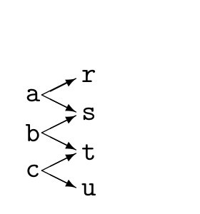

<!-- 源 PDF 物理页 247；原书印刷页 235 -->

 **习题 15.12**〔难度 3；解答见原书印刷页 239〕信道 $Q$ 的输入是一个 $8$ 比特的词，输出也是一个 $8$ 比特的词。每使用一次信道，它都会将传输的比特中*恰好一个*翻转，但接收方不知道翻转的是哪一个；另外七个比特都无差错地收到。八个比特被翻转的概率相同。求这个信道的容量。

请描述一个*明确的*编码器和译码器，证明可以通过这个信道每次*可靠地*传送 $5$ 比特；这里的“可靠”是指差错概率为*零*。

▷ **习题 15.13**〔难度 2〕一个信道的输入 $x\in\{a,b,c\}$、输出 $y\in\{r,s,t,u\}$，其条件概率矩阵为

$$Q=\begin{bmatrix}1/2&0&0\\1/2&1/2&0\\0&1/2&1/2\\0&0&1/2\end{bmatrix}.$$

原书无编号图的箭头表示可能的输入输出对应关系：$a$ 可到达 $r,s$，$b$ 可到达 $s,t$，$c$ 可到达 $t,u$。

这个信道的容量是多少？

▷ **习题 15.14**〔难度 3〕书封面上的十位数 ISBN 含有一个检错码。它由九个源数字 $x_1,x_2,\ldots,x_9$（其中 $x_n\in\{0,1,\ldots,9\}$）和第十个校验数字组成；校验数字的值为

<table><tbody><tr><td>0-521-64298-1</td></tr><tr><td>1-010-00000-4</td></tr></tbody></table>

表 15.1　一些有效的 ISBN。［连字符仅为便于阅读而加入。］

$$x_{10}=\left(\sum_{n=1}^{9}n x_n\right)\bmod 11.$$

这里 $x_{10}\in\{0,1,\ldots,9,10\}$。如果 $x_{10}=10$，就用罗马数字 X 表示第十位。

证明有效的 ISBN 满足

$$\left(\sum_{n=1}^{10}n x_n\right)\bmod 11=0.$$

设想 ISBN 通过一条不可靠的“人类信道”传递，这条信道有时会*改动*数字，有时会*调换*数字的顺序。

证明此码能检测（但不能纠正）十位数字中任意一位被改动的所有差错，例如 `1-010-00000-4` 变为 `1-010-00080-4`。

证明此码能检测任意两个相邻数字交换位置造成的所有差错，例如 `1-010-00000-4` 变为 `1-100-00000-4`。

还有哪些*不相邻*数字对的交换能够被检测到？

如果把第十位数字定义为

$$x_{10}=\left(\sum_{n=1}^{9}n x_n\right)\bmod 10,$$

为什么这个码就不能同样有效地工作？（请分别讨论单个数字被改动和数字交换位置这两类差错的检测。）
