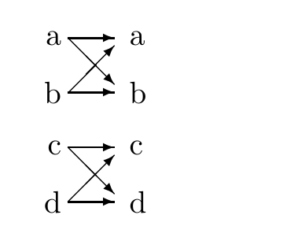

<!-- 源 PDF 物理页 248；原书印刷页 236 -->

 **习题 15.15**〔难度 3〕一个信道的输入为 $x$、输出为 $y$，其转移概率矩阵为

$$Q=\begin{bmatrix}1-f&f&0&0\\f&1-f&0&0\\0&0&1-g&g\\0&0&g&1-g\end{bmatrix}.$$

原书无编号图的箭头表示：输入 $a,b$ 都可能输出为 $a$ 或 $b$；输入 $c,d$ 都可能输出为 $c$ 或 $d$。两组之间没有转移。

假定输入分布为

$$\mathcal P_X=\left\{\frac p2,\frac p2,\frac{1-p}{2},\frac{1-p}{2}\right\},$$

写出输出的熵 $H(Y)$，以及已知输入时输出的条件熵 $H(Y\mid X)$。

证明最优输入分布由下式给出：

$$p=\frac{1}{1+2^{-H_2(g)+H_2(f)}},$$

其中 $H_2(f)=f\log_2\frac1f+(1-f)\log_2\frac1{1-f}$。

> **原书页边提示。** 记住 $\frac{\mathrm d}{\mathrm dp}H_2(p)=\log_2\frac{1-p}{p}$。

当 $f=1/2$、$g=0$ 时，写出最优输入分布和信道容量，并对答案加以评论。

▷ **习题 15.16**〔难度 2〕检错码（能够可靠地检测出一个数据分组已被破坏）和纠错码（能够检测并纠正差错）所需的冗余有什么区别？

## *信息论的更多故事*

下面的习题将让你自己发现信息论中另外一些令人意外的结果。

**习题 15.17**〔难度 3〕相关信源的信息传输。设想要通过无噪声的单向通信信道，把两个数据源 $X^{(A)}$ 和 $X^{(B)}$ 的数据传到中心位置 $C$（图 15.2a）。信号 $x^{(A)}$ 和 $x^{(B)}$ 高度相关，因此两者的联合信息量只比其中任意一个的边缘信息量略大。例如，$C$ 是一名天气信息汇总员，希望收到一串报告，分别说明 Allerton 是否下雨（$x^{(A)}$），以及 Bognor 是否下雨（$x^{(B)}$）。$x^{(A)}$ 与 $x^{(B)}$ 的联合概率可能为

$$P(x^{(A)},x^{(B)}):\quad\begin{array}{c|cc}&x^{(A)}=0&x^{(A)}=1\\\hline x^{(B)}=0&0.49&0.01\\x^{(B)}=1&0.01&0.49\end{array}\tag{15.3}$$

这名天气信息汇总员想准确知道 $x^{(A)}$ 和 $x^{(B)}$ 各自连续 $N$ 次的取值；但由于收到的每一比特信息都要付费，他希望不必从信源 $A$ 买入 $N$ 比特，*又*从信源 $B$ 买入 $N$ 比特。假设 $x^{(A)}$ 与 $x^{(B)}$ 是反复从上述分布产生的，能否分别以码率 $R_A$ 和 $R_B$ 编码，使 $C$ 重建所有变量，而且两条线路的信息传输率之和小于每轮 $2$ 比特？
