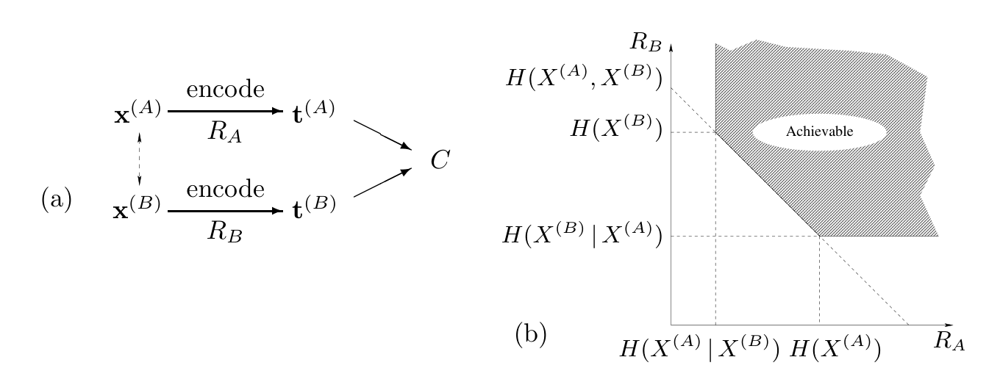
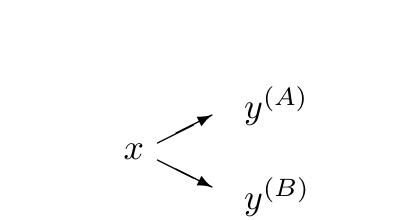

<!-- 源 PDF 物理页 249；原书印刷页 237。末段关于分时的句子接续至 PDF 250，在此合为原段。 -->

图 15.2　相关信源的信息传输。(a) $x^{(A)}$ 和 $x^{(B)}$ 是相关信源，虚线双向箭头表示相关性。各自的取值序列经过“编码”（encode），分别以码率 $R_A$ 和 $R_B$ 变为发送序列 $t^{(A)}$ 和 $t^{(B)}$，再经无噪信道送到接收方 $C$。(b) 可达码率区域；图内的 “Achievable” 表示“可达”，横轴为 $R_A$，纵轴为 $R_B$。横轴标出 $H(X^{(A)}\mid X^{(B)})$、$H(X^{(A)})$，纵轴标出 $H(X^{(B)}\mid X^{(A)})$、$H(X^{(B)})$ 和联合熵 $H(X^{(A)},X^{(B)})$。即使 $R_A<H(X^{(A)})$ 且 $R_B<H(X^{(B)})$，两路序列仍可无差错传送。

答案见图 15.2；你应当证明它。一般而言，给定两个相关信源 $X^{(A)}$ 和 $X^{(B)}$，只要来自 $X^{(A)}$ 的信息率 $R_A$ 超过 $H(X^{(A)}\mid X^{(B)})$，来自 $X^{(B)}$ 的信息率 $R_B$ 超过 $H(X^{(B)}\mid X^{(A)})$，且总信息率 $R_A+R_B$ 超过联合熵 $H(X^{(A)},X^{(B)})$，就存在分别供两个发送方使用的码，使它们都能可靠地向 $C$ 传送数据（Slepian and Wolf, 1973）。

因此，对于上面的 $x^{(A)}$ 和 $x^{(B)}$，每个发送方的码率都必须大于 $H_2(0.02)=0.14$ 比特，总码率 $R_A+R_B$ 必须大于 $1.14$ 比特，例如 $R_A=0.6$、$R_B=0.6$。有些码能够达到这些码率。你的任务是弄清为什么。

试着找出一个明确的方案：一个信源的数据原样发送，即 $t^{(B)}=x^{(B)}$，另一个信源的数据则经过编码。

**习题 15.18**〔难度 3〕多址信道。考虑一个有两组输入、一个输出的信道，例如一条共用电话线（图 15.3a）。一个简单模型有两个二元输入 $x^{(A)}$、$x^{(B)}$，输出 $y$ 是两输入的算术和，因此是取值为 $0$、$1$ 或 $2$ 的三元符号。信道没有噪声。用户 $A$ 和 $B$ 不能相互通信，也听不到信道的输出。如果输出是 $0$，接收方可以确信两个输入都为 $0$；如果输出是 $2$，接收方可以确信两个输入都为 $1$；但如果输出是 $1$，输入状态既可能是 $(0,1)$，也可能是 $(1,0)$。用户 $A$ 和 $B$ 应如何使用这个信道，才能让接收方从收到的信号推断出各自的消息？他们能以多高的速率通信？

显然，从 $A$、$B$ 到接收方的总信息率不可能达到 $2$ 比特。另一方面，很容易达到总信息率 $R_A+R_B=1$ 比特。能否在 $R_A+R_B>1$ 的码率对 $(R_A,R_B)$ 上实现可靠通信？

答案见图 15.3。

Ratzer and MacKay (2003) 给出了一些用于多用户信道的实用码。

**习题 15.19**〔难度 3〕广播信道。广播信道由一个发送方和两个或更多接收方组成。信道的性质由条件分布 $Q(y^{(A)},y^{(B)}\mid x)$ 确定。［这里假设信道无记忆。］任务是增加一个编码器和两个译码器，使发送方能以码率 $R_0$ 向两个接收方可靠传送一条共同消息，以码率 $R_A$ 向接收方 $A$ 单独传送一条消息，并以码率 $R_B$ 向接收方 $B$ 单独传送一条消息。广播信道的*容量*区域，是所有可达码率三元组 $(R_0,R_A,R_B)$ 构成的集合的凸包。

图 15.4　广播信道。图内 $x$ 是信道输入，分叉后的 $y^{(A)}$ 和 $y^{(B)}$ 是分别到达接收方 $A$ 和 $B$ 的输出。

分时（时分信令）为这样的信道提供了一个简单的基准。若单独考察两条信道时，它们的容量分别为 $C^{(A)}$ 和 $C^{(B)}$，那么将传输时间的比例 $\phi_A$ 分给信道 $A$，将 $\phi_B=1-\phi_A$ 分给信道 $B$，就能达到 $(R_0,R_A,R_B)=(0,\phi_A C^{(A)},\phi_B C^{(B)})$。
