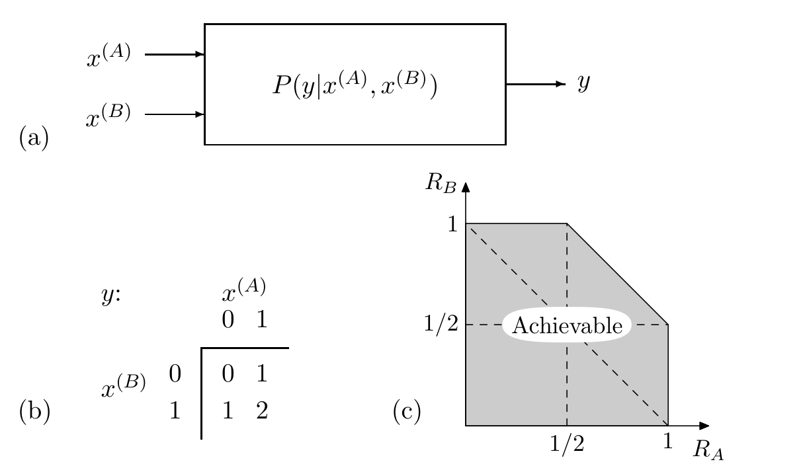
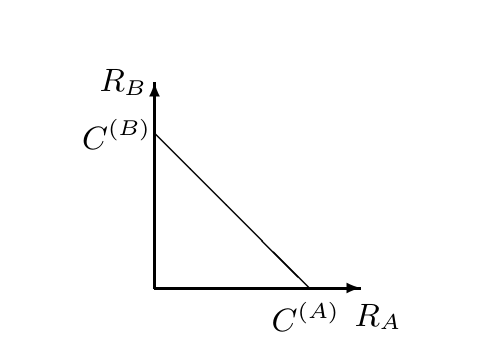
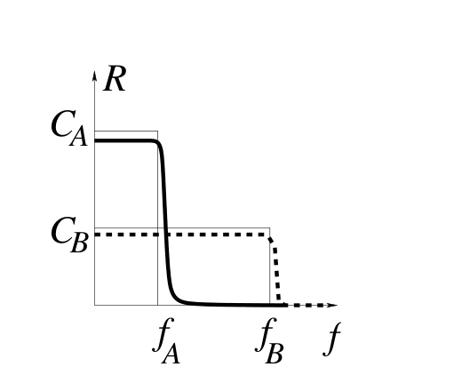

<!-- 源 PDF 物理页 250；原书印刷页 238。习题 15.20 末段在 PDF 251 接续，已在本页合为原段。 -->

图 15.3　多址信道。(a) 两个发送方、一个接收方的一般多址信道；图内 $x^{(A)}$、$x^{(B)}$ 是输入，$y$ 是输出，$P(y\mid x^{(A)},x^{(B)})$ 是信道规律。(b) 二元多址信道的输出等于两个输入之和；图内表格的列为 $x^{(A)}=0,1$，行为 $x^{(B)}=0,1$，对应输出 $y$ 依次为第一行 $0,1$，第二行 $1,2$。(c) 可达码率区域；图内 “Achievable” 表示“可达”，横轴为 $R_A$，纵轴为 $R_B$，两轴都标有 $1/2$ 与 $1$。

不过，我们可以做得比单纯分时更好。打个比方：设想你同时对一位美国人和一位白俄罗斯人讲话。你会说美式英语，也会说白俄罗斯语，但两位听众都听不懂对方的语言。如果每位听众都能分辨一个词是不是自己语言中的词，那么还可以向两人额外传送一份二进制文件：用文件的每一位决定下一个词取自美式英语文本，还是取自白俄罗斯语文本。每位听众可以把自己能听懂的词连起来，获得给自己的消息，同时也能恢复那串二进制数字。

图 15.5　简单分时所能达到的码率。图内横轴 $R_A$、纵轴 $R_B$ 分别是给接收方 $A$、$B$ 的码率；斜线连接横轴的 $C^{(A)}$ 与纵轴的 $C^{(B)}$。

广播信道的一个例子，是两个二元对称信道共用一个输入。信道的两部分的比特翻转概率分别为 $f_A$ 和 $f_B$。假设 $A$ 的信道部分更好，即 $f_A<f_B<1/2$。［与此密切相关的一种信道叫“退化”广播信道，其条件概率使随机变量构成如下 Markov 链：

$$x\to y^{(A)}\to y^{(B)},\tag{15.4}$$

也就是说，$y^{(B)}$ 是 $y^{(A)}$ 进一步退化后的版本。］在这一特殊情形下，凡是能够传到接收方 $B$ 的信息，接收方 $A$ 也都能恢复。因此，没必要再区分 $R_0$ 和 $R_B$：问题变为求码率对 $(R_0,R_A)$ 的容量区域，其中 $R_0$ 是同时传到 $A$ 和 $B$ 的信息码率，$R_A$ 是额外传到 $A$ 的信息码率。

下一道习题与这道习题等价；图 15.8 给出了一种解法。

图 15.6　为噪声水平 $f_A$（实线）和 $f_B$（虚线）设计的 Shannon 式码，其可靠通信码率 $R$ 随实际噪声水平 $f$ 的变化。图内纵轴为 $R$，标有容量 $C_A,C_B$；横轴为 $f$，标有 $f_A,f_B$。

**习题 15.20**〔难度 3〕噪声水平未知的信道所用的可变码率纠错码。现实中，有时在安装编码器之前还不能充分了解信道。为了模拟这种情形，设已知信道是二元对称信道，但噪声水平可能是 $f_A$，也可能是 $f_B$。令 $f_B>f_A$，两种情况下的信道容量分别为 $C_A$ 和 $C_B$。

愿意冒险的人或许会安装一套按噪声水平 $f_A$ 设计的系统，其码率为 $R_A\simeq C_A$。如果实际噪声水平却是 $f_B$，依据我们对 Shannon 理论的理解，就会预期可靠通信彻底失败（图 15.6 中的实线）。
