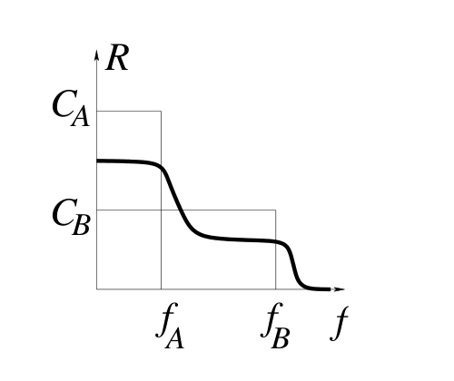
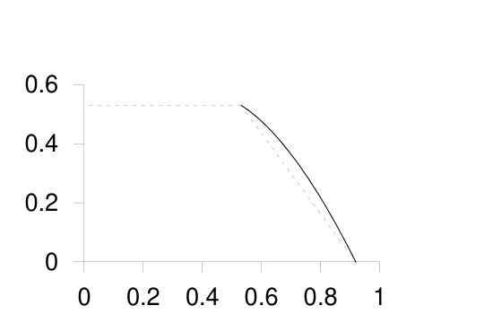

<!-- 源 PDF 物理页 251；原书印刷页 239。页首接续习题 15.20；习题 15.21 的图 15.9 位于下一页。 -->

一种保守的做法是按最坏情形设计编码系统，安装码率为 $R_B\simeq C_B$ 的码（图 15.6 中的虚线）。如果实际噪声水平较低，为 $f_A$，管理者就会因为浪费了容量差额 $C_A-R_B$ 而感到遗憾。

能否建立这样一个系统：无论噪声水平是哪一个，它都能以某个码率 $R_0$ 可靠传送；当噪声水平较低时，还能额外传送一些“优先级较低”的比特，如图 15.7 所示？这种码在 $f_A$ 到 $f_B$ 的所有噪声水平下都能可靠传送高优先级比特；如果噪声水平不高于 $f_A$，还能传送低优先级比特。

图 15.7　期望的*可变码率*码的可靠通信码率 $R$ 随噪声水平 $f$ 的变化。图内纵轴为 $R$，标有容量 $C_A,C_B$；横轴为 $f$，标有 $f_A,f_B$。曲线在低噪声时传送额外信息，在较高噪声时仍保留基础码率。

在数学上，这个问题等价于前面的退化广播信道问题。那里把较低的通信码率称为 $R_0$，而把噪声水平较低时低优先级比特的通信码率称为 $R_A$。

图 15.8 给出了 $f_A=0.01$、$f_B=0.1$ 时的一种示例解。［该图也给出了两条分信道的噪声水平分别为 $f_A=0.01$、$f_B=0.1$ 的广播信道的可达区域。］坦率说，简单分时方案与巧妙方案之间的差距之小，令我有些失望。

图 15.8　噪声水平未知的信道的一个可达区域。假设两种可能的噪声水平是 $f_A=0.01$ 和 $f_B=0.1$。图内横轴刻度从 $0$ 到 $1$，纵轴刻度从 $0$ 到 $0.6$。虚线表示简单分时方案能达到的码率对 $(R_A,R_B)$，实线表示一种更巧妙的方案能达到的码率。

第 50 章会讨论一类特殊广播信道——擦除信道——所用的码。在擦除信道中，每个符号要么无差错地收到，要么被擦除。这些码有一个很好的性质：它们是*无固定码率*的（rateless）。传输多少个符号可以在传输过程中随时决定，从而无论信道的擦除统计特性如何，都能实现可靠通信。

**习题 15.21**〔难度 3〕多终端信息网络既有重要的实际用途，也有引人入胜的理论问题。考虑下面这个双向二元信道的例子（图 15.9a、b）：两个人都想通过信道说话，也都想听到对方说什么；但只有在自己发送 $0$ 时，才能听到对方发送的信号。从 $A$ 到 $B$ 以及从 $B$ 到 $A$，可以同时达到怎样的信息率？怎样达到？这类网络的日常例子有船舶使用的甚高频（VHF）信道，以及计算机以太网；在以太网中，如果两台或更多设备同时广播，*所有*设备都听不到*任何内容*。

显然，通过简单分时，两个方向都能达到 $1/2$ 的码率。但能否把两个信息率提高？一般双向信道的容量至今仍是一个开放问题。不过，对于上面这个简单二元信道，我们可以得到一些有趣的可达点结果，如图 15.9c 所示。有些码能达到图示边界上的码率，也可能存在更好的码。

## 解答

**习题 15.12 的解答**（原书印刷页 235）。$C(Q)=5$ 比特。

最后一问的提示：存在一种使用简单的 $(8,5)$ 码的解法。
