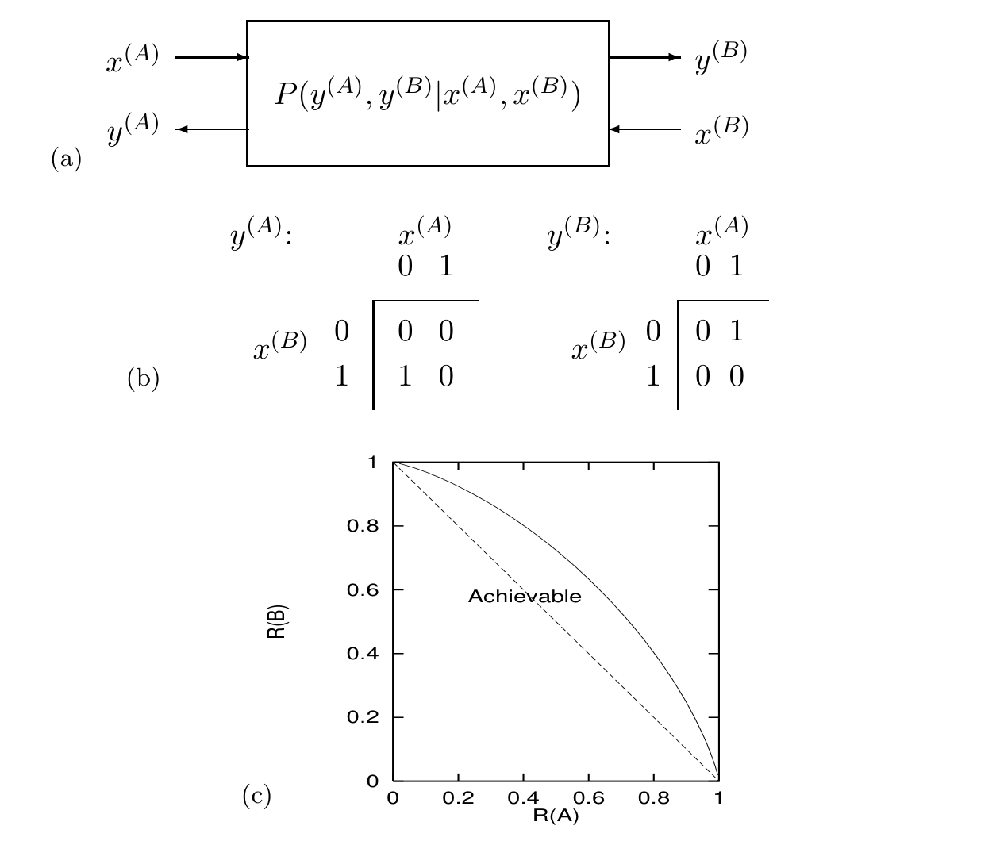

<!-- 源 PDF 物理页 252；原书印刷页 240 -->

图 15.9　(a) 一般的双向信道：图内 $x^{(A)}$、$x^{(B)}$ 是两端输入，$y^{(A)}$、$y^{(B)}$ 是两端输出，信道规律为 $P(y^{(A)},y^{(B)}\mid x^{(A)},x^{(B)})$。(b) 二元双向信道的规则：两张表按输入的不同状态给出输出 $y^{(A)}$、$y^{(B)}$；列是 $x^{(A)}=0,1$，行是 $x^{(B)}=0,1$。$y^{(A)}$ 表的两行分别为 $(0,0)$、$(1,0)$；$y^{(B)}$ 表的两行分别为 $(0,1)$、$(0,0)$。(c) 双向二元信道的可达码率区域；图内 “Achievable” 表示“可达”，横轴为 $R^{(A)}$，纵轴为 $R^{(B)}$，两轴刻度均从 $0$ 到 $1$。实线以下的码率可达，虚线表示用简单分时可得到的“显然可达”区域。
