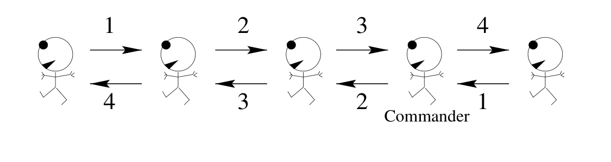
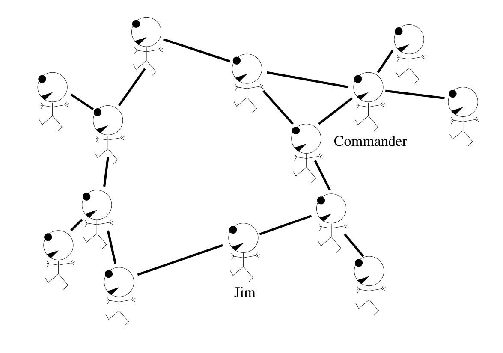

<!-- 源 PDF 物理页 254；原书印刷页 242。页首三项加法接续前页末段。原书图 16.3 穿插于同一段的两句之间，此处合为一段再置图。 -->

<table><tbody>
<tr><td></td><td>前面的士兵告诉指挥官的数</td><td>（它等于前方士兵的总数）</td></tr>
<tr><td>＋</td><td>后面的士兵告诉指挥官的数</td><td>（它等于后方士兵的总数）</td></tr>
<tr><td>＋</td><td>一</td><td>（把指挥官本人也算进去）</td></tr>
</tbody></table>

这种解法只需局部通信设备和简单的计算（存储整数并把整数相加）。

图 16.2　一队士兵按消息传递规则集 A 数出自身人数。图内的 “Commander” 是指挥官；上方箭头从左向右依次传 $1,2,3,4$，下方箭头从右向左依次传 $1,2,3,4$。指挥官把前方士兵报来的 $3$、后方士兵报来的 $1$，以及自己的 $1$ 相加，得出共有 $5$ 名士兵。

### *分离性*

这个巧妙办法利用了士兵总数的一个重要性质：它可以写成某一点*前方*的士兵数与该点*后方*的士兵数之和。这两个量可以*分别*计算，因为指挥官把两组士兵隔开了。

如果士兵不是排成一列，而是成群行进，就不容易像这样把他们分成两组。图 16.3 中的游击队员不能使用上述消息传递规则集 A 来计数：虽然他们各有邻居（图中以线段表示），但不清楚谁在“前面”、谁在“后面”；而且，他们的连接*图*中有环，所以环上的游击队员（例如 Jim）无法把队伍*分成*“前面的人”和“后面的人”两组。

图 16.3　一群游击队员。图内 “Commander” 是指挥官，“Jim” 是 Jim；线段表示队员之间的连接，其中有环。

*只要游击队员之间的连接图没有环*，就可以用修改后的消息传递算法数出这群人的总数。

规则集 B 是一种消息传递算法，用于统计连接关系构成无环图（cycle-free graph，又称树）的游击队员人数，如图 16.4 所示。任何一名游击队员都能根据自己收到的消息，推算树中的总人数。
