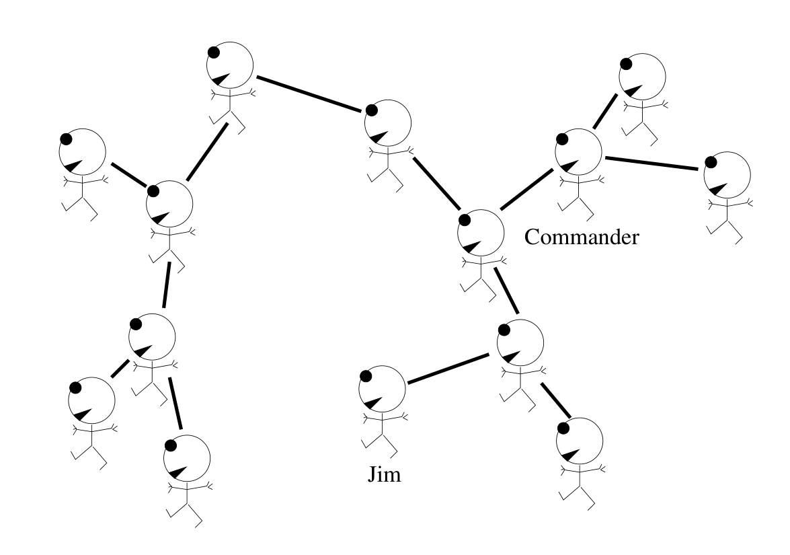
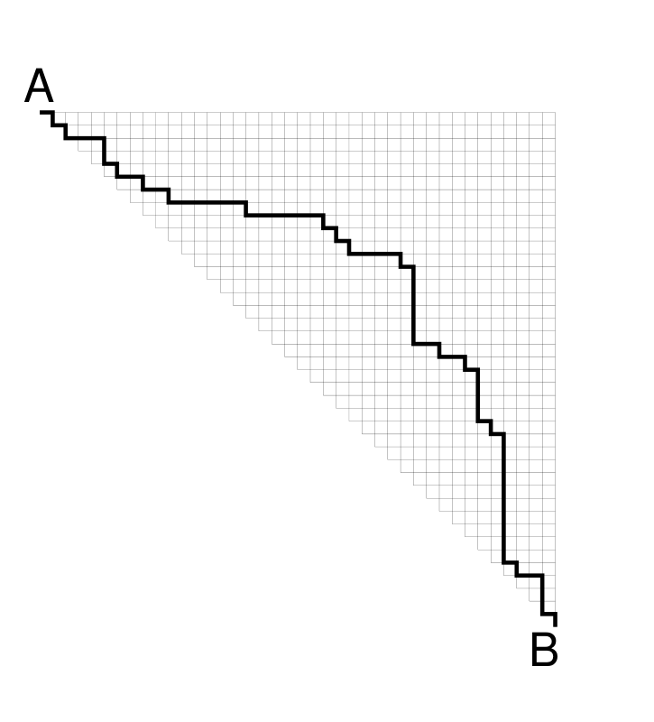

<!-- 源 PDF 物理页 255；原书印刷页 243。原书将编号 16.5 用于算法，图号因此由 16.4 跳到 16.6。 -->

图 16.4　一群连接关系构成树的游击队员。图内 “Commander” 是指挥官，“Jim” 是 Jim；各线段连接队员，图中没有环。

**算法 16.5　消息传递规则集 B**

1. 数一数自己有多少个邻居，记为 $N$。
2. 记录已经从邻居收到的消息数 $m$，以及各条消息的值 $v_1,v_2,\ldots,v_N$。令 $V$ 为目前收到的消息值之和。
3. 如果已收到的消息数 $m=N-1$，找出还没有向你发消息的邻居，把数 $V+1$ 告诉他。
4. 如果已收到的消息数 $m=N$，那么：

(a) 数 $V+1$ 就是所求的总人数。

(b) 对每个邻居 $n$ { 
　向邻居 $n$ 报数 $V+1-v_n$。 
}

图 16.6　一个三角形的 $41\times41$ 网格。从 $A$ 到 $B$ 有多少条路径？图中用粗线示出其中一条。
