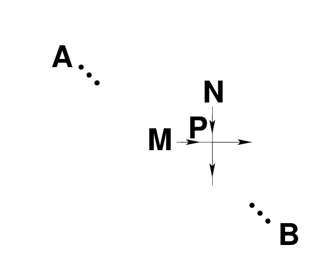
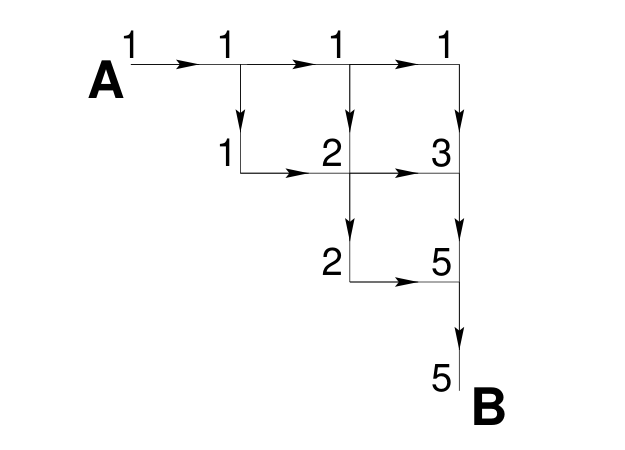
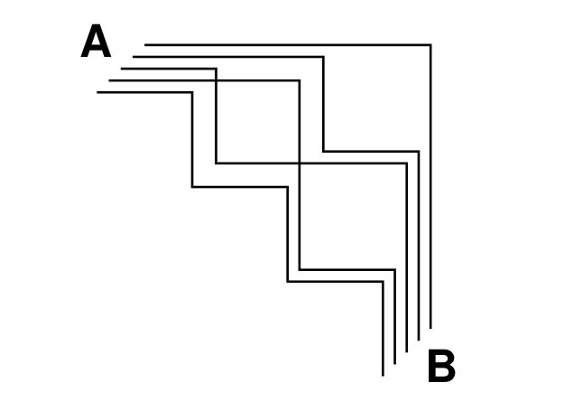
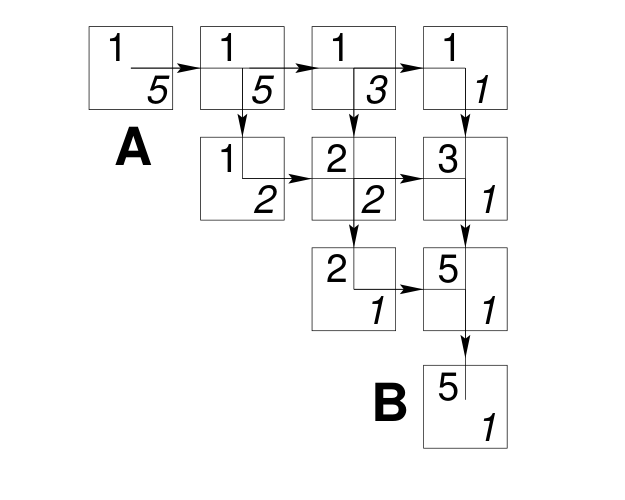

<!-- 源 PDF 物理页 256；原书印刷页 244。习题 16.1 的后半句和提示原排于 PDF 257，此处并回完整题目。图 16.6 图注称“三角形网格”，本页正文称“矩形网格”，依原书分别保留。 -->

## 16.2　路径计数

比数士兵更深入的任务，是数出穿过一个网格的路径总数，以及有多少条路径经过网格中的任意给定点。

图 16.6 给出一个矩形网格，以及连接 $A$、$B$ 两点的一条路径。合法路径从 $A$ 出发，只向右或向下移动，直到 $B$。我们要问：

1. 从 $A$ 到 $B$ 这样的路径共有多少条？
2. 如果随机选取一条从 $A$ 到 $B$ 的路径，它经过网格中某个特定节点的概率是多少？［这里的“随机”，是指所有*路径*被选中的概率完全相同。］
3. 怎样随机选取一条从 $A$ 到 $B$ 的路径？

数出从 $A$ 到 $B$ 的所有路径，乍看并不容易。路径数应该相当大：即使只允许走一条宽度仅为三个节点的对角带，也仍会有约 $2^{N/2}$ 条可走路径。

计算上的关键突破在于：要找到路径*条数*，无须显式列举所有路径。取网格中的一点 $P$，考虑从 $A$ 到 $P$ 有多少条路径。每条从 $A$ 到 $P$ 的路径，都必须从 $P$ 的某个上游邻居进入 $P$；这里的“上游”是指上方或左方。因此，把从 $A$ 到这些邻居的路径数相加，就得到从 $A$ 到 $P$ 的路径数。

图 16.7　每条从 $A$ 到 $P$ 的路径，都从 $P$ 的一个上游邻居进入 $P$，即 $M$ 或 $N$。所以，从 $A$ 到 $P$ 的路径数，等于从 $A$ 到 $M$ 的路径数与从 $A$ 到 $N$ 的路径数之和。图中的箭头给出向右、向下的移动方向。

图 16.8 在一个简单网格上演示这一消息传递算法。该网格有十个顶点，由十二条有向边连接。我们从 $A$ 发出数值为“$1$”的消息。当某个节点收齐所有上游邻居的消息后，就把这些值的*和*传给下游邻居。到达 $B$ 时，得到数 $5$：我们没有逐一枚举路径，却已数出从 $A$ 到 $B$ 的路径条数。图 16.9 画出这五条不同路径，可用来核对结果。

图 16.8　前向传递的消息。图中各数字是从 $A$ 到相应节点的路径数；到 $B$ 的数值为 $5$。

图 16.9　从 $A$ 到 $B$ 的五条路径。

数出全部路径后，我们可以继续处理更难的问题：求随机路径经过某个给定顶点的概率，以及实际生成一条随机路径。

### *经过节点的概率*

除了前向传递，再做一次反向传递，就能算出经过每个节点的路径条数；再除以路径总数，便得到随机选取的路径经过该节点的概率。图 16.10 将反向传递的消息标在各方格右下角，原先前向传递的消息标在左上角。把某个顶点处的这两个数相乘，就得到经过该顶点的路径总数。例如，经过中央顶点的路径有四条。

图 16.10　前向和反向传递的消息。每个节点方格左上角是从 $A$ 到该节点的路径数，右下角是从该节点到 $B$ 的路径数；两数的乘积给出经过该节点的路径数。

图 16.11 展示了对 $41\times41$ 三角形网格进行这一计算的结果。图中每个黑色斑点的面积，与路径经过相应节点的概率成正比。

### *随机路径采样*

 **习题 16.1**［难度 1；解答见原书印刷页 247］如果在每个可以选择两个方向的交叉点，都掷一枚公平硬币来生成从 $A$ 到 $B$ 的“随机”路径，那么得到的路径是从全部路径中均匀随机抽取的吗？［提示：试着在图 16.8 的网格上这样做。］
