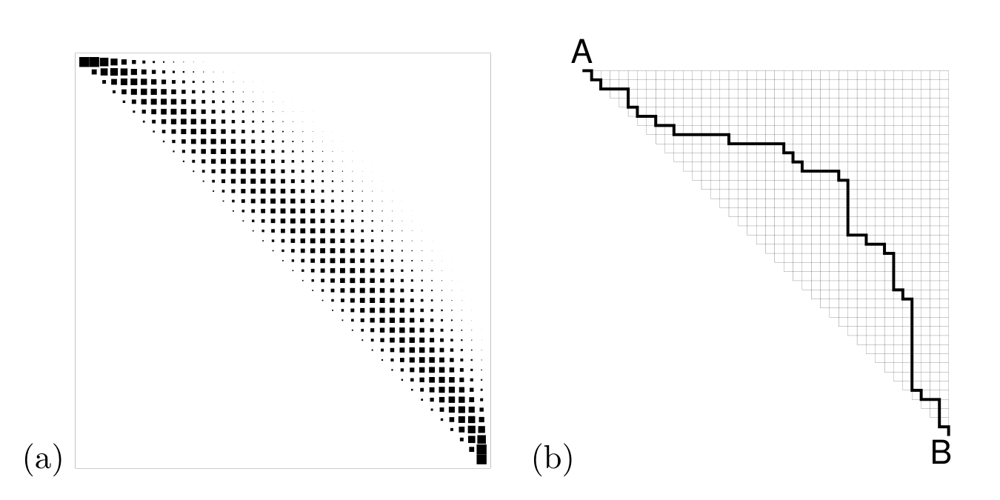
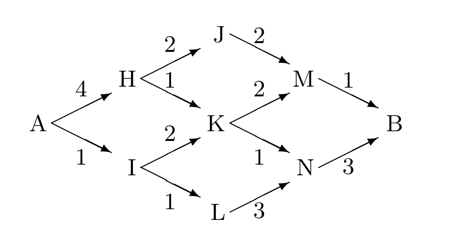

<!-- 源 PDF 物理页 257；原书印刷页 245。页首习题 16.1 的续句已并入 PDF 256；末段方括号中的并列最短路说明续于 PDF 258，此处并回完整句。 -->

这里有一个巧妙的思路；我希望你能享受到自己想出答案的乐趣。

 **习题 16.2**［难度 2；解答见原书印刷页 247］已经在网格上对 $A$ 与 $B$ 之间的路径运行前向和反向算法，怎样从 $A$ 到 $B$ 的全部路径中*均匀地*随机抽取一条？（见图 16.11。）

图 16.11　(a) 路径经过各节点的概率；(b) 随机选取的一条路径。左图黑色斑点的面积表示相应概率，右图的黑色折线表示从 $A$ 到 $B$ 的样本路径。

我们用来数出通往 $B$ 的路径条数的消息传递算法，是*和积算法*（sum–product algorithm）的一个例子。“求和”发生在每个节点将前驱节点传来的消息相加时；前文没有提到“乘积”，但也可以把这里的求和看成加权求和，只是每一项的权重碰巧都是 $1$。

## 16.3　寻找最低成本路径

假设你想尽快从 Ambridge（$A$）到达 Bognor（$B$）。图 16.12 给出各种可选路线，并标明走过图中每条边所需的小时数。例如，路线 $A$–$I$–$L$–$N$–$B$ 需要 $8$ 小时。我们想找出成本最低的路径，但不想显式计算每条路径的成本。高效的办法是：对每个节点，求出从 $A$ 到达该节点的最低成本。可以从节点 $A$ 出发，通过消息传递算出这些值。这个消息传递算法称为*最小和算法*（min–sum algorithm），也称 *Viterbi 算法*。

图 16.12　从 Ambridge（$A$）到 Bognor（$B$）的路线图。箭头标明行进方向，边旁的数字表示走过该边的成本，单位为小时。

为简便起见，我们把从节点 $A$ 到节点 $x$ 的最低成本路径的成本，称为“$x$ 的成本”。每个节点一旦知道所有可能前驱节点的成本，就能把自己的成本广播给后继节点。下面手工执行一遍算法。$A$ 的成本为零。我们把这个消息传给 $H$ 和 $I$。消息沿图中的每条边传递时，都要*加上*这条边的成本。于是算出 $H$ 和 $I$ 的成本分别为 $4$ 和 $1$（图 16.13a）。同样，可算出 $J$ 和 $L$ 的成本分别为 $6$ 和 $2$；但 $K$ 呢？从边 $H$–$K$ 传来的消息表明，经 $H$ 从 $A$ 到 $K$ 的一条路径成本为 $5$；从边 $I$–$K$ 则得知另一条路径的成本为 $3$（图 16.13b）。最小和算法把 $K$ 的成本设为这两个值中的最小值（即“最小”），并只保留边 $I$–$K$、剪去通向 $K$ 的其他边，以记录进入 $K$ 的最低成本路线（图 16.13c）。图 16.13d 和 e 展示了算法剩余的两轮迭代，最终发现从 $A$ 到 $B$ 有一条成本为 $6$ 的路径。［如果到达某个节点的最低成本路径不止一条，最小和算法遇到并列时，可以随机选取其中任意一条。］
