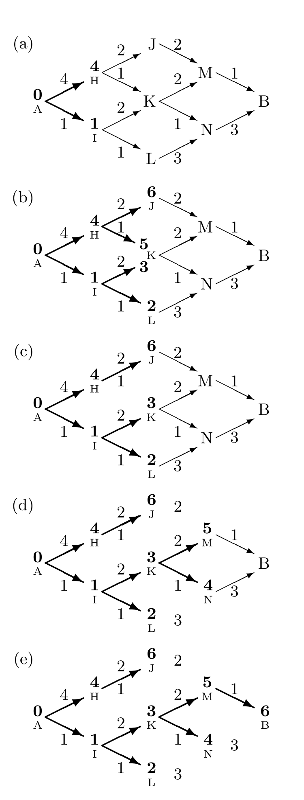
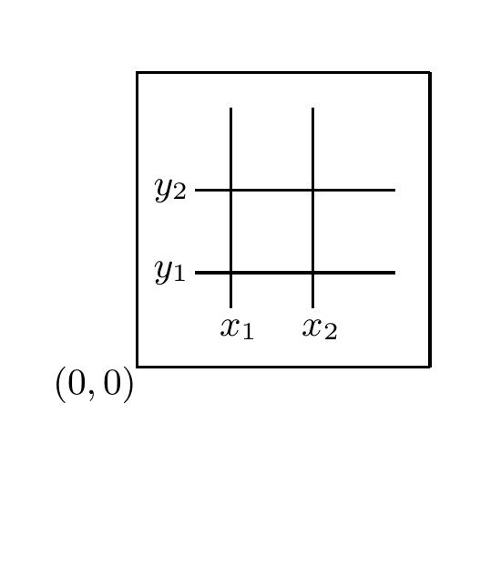

<!-- 源 PDF 物理页 258；原书印刷页 246。页首并列最短路说明的后半句已并入 PDF 257。原书此页称可用最小和算法求关键路径，依原文保留。 -->

从 $B$ 出发，沿保留下来的边回溯到 $A$，便能找回这条最低成本路径。由此得到最低成本路径为 $A$–$I$–$K$–$M$–$B$。

图 16.13　最小和消息传递算法：先求到达每个节点的成本，进而找出从 $A$ 到 $B$ 的最低成本路线。(a)–(e) 展示连续计算与剪枝的过程；节点旁的粗体数字是算出的最低成本，边旁的数字是走过该边的成本，最后得到 $B$ 的成本为 $6$。

### *最小和算法的其他应用*

设想你负责通过一系列生产操作，把原材料加工成产品。你想找出流程中的*关键路径*（critical path），也就是拖慢生产的那组操作。如果把关键路径上的任一操作做得稍快一些，从原材料到成品所需的时间就会缩短。

一组操作的关键路径可以用最小和算法找出。

第 25 章会用最小和算法译码纠错码。

## 16.4　总结与相关想法

有些全局函数具有可分离性。例如，从 $A$ 到 $P$ 的路径条数，可以分解为从 $A$ 到 $M$（$P$ 左侧的点）的路径条数，加上从 $A$ 到 $N$（$P$ 上方的点）的路径条数。这类函数可通过消息传递高效计算。另一些函数则没有这种可分离性，例如：

1. 一队士兵中，生日相同的士兵有多少对；
2. 一队士兵中，身高相同（四舍五入到最接近的厘米）的最大一组有多少人；
3. 旅行商走访一队士兵中每个人所能走出的最短路线有多长。

机器学习的一项挑战，是为这类问题找出成本较低的解。寻找一大组取值近似相等的变量，可以通过神经网络方法解决（Hopfield and Brody, 2000；Hopfield and Brody, 2001）。第 42.9 节将讨论旅行商问题的神经网络方法。

## 16.5　补充习题

▷ **习题 16.3**〔难度 2〕对于宽和高均为 $N$ 的三角形网格，描述图 16.11a 所示概率在渐近情况下的性质。

▷ **习题 16.4**〔难度 2〕在图像处理中，由图像 $f(x,y)$ 得到的*积分图像*（integral image）$I(x,y)$ 定义如下，其中 $x$ 和 $y$ 是像素坐标：

$$I(x,y)\equiv\sum_{u=0}^{x}\sum_{v=0}^{y}f(u,v).\tag{16.1}$$

证明可以通过消息传递高效地计算积分图像 $I(x,y)$。

再证明，从积分图像可以得到图像的一些简单函数。例如，对于从 $(x_1,y_1)$ 延伸到 $(x_2,y_2)$ 的矩形区域，给出其中所有 $(x,y)$ 处图像强度 $f(x,y)$ 之和的表达式。

积分图像示意图（习题 16.4）　$(0,0)$ 标出图像坐标原点；两条竖线分别对应 $x_1,x_2$，两条横线分别对应 $y_1,y_2$，用来界定待求和的矩形区域。
