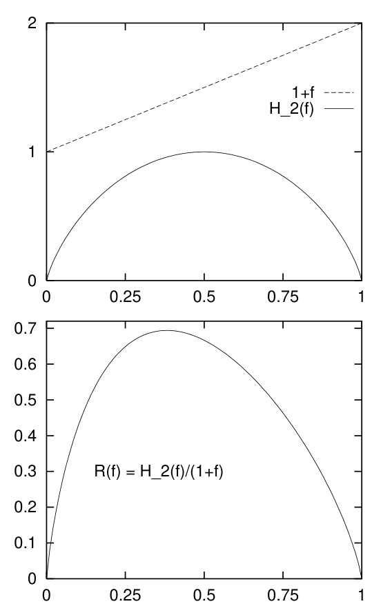

<!-- 源 PDF 物理页 262；原书印刷页 250。页首续上一页末句；页末续于 PDF 263。 -->

具体做法是降低所传输的 $1$ 所占的比例。设想向码 $C_2$ 输入一个比特流，其中 $1$ 的频率为 $f$。［这样的比特流可以这样得到：把任意二进制文件送入某个算术码的译码器，该算术码对于压缩密度为 $f$ 的二元比特串是最优的。］所达到的信息传输率 $R$，等于信源的熵 $H_2(f)$ 除以平均传输长度

$$L(f)=(1-f)+2f=1+f.\tag{17.6}$$

因此

$$R(f)=\frac{H_2(f)}{L(f)}=\frac{H_2(f)}{1+f}.\tag{17.7}$$

未经预处理的原始码 $C_2$ 对应 $f=1/2$。如果把 $f$ 略微调小，令

$$f=\frac{1}{2}+\delta,\tag{17.8}$$

其中 $\delta$ 是一个很小的负数，会怎样？在 $f=1/2$ 附近，分母 $L(f)$ 随 $\delta$ 线性变化；相比之下，分子 $H_2(f)$ 对 $\delta$ 的依赖只有二阶。

▷ **习题 17.4**〔难度 1〕求 $H_2(f)$ 关于 $\delta$ 的 Taylor 展开，精确到 $\delta^2$ 阶。

从一阶来看，随着 $\delta$ 减小，$R(f)$ 线性增大。因此，减小 $f$ 应当能够提高 $R$。图 17.1 展示了这些函数：随着 $f$ 减小，$R(f)$ 确实会增大，并在 $f\simeq0.38$ 时达到最大值，约为每次使用信道 $0.69$ 比特。

图 17.1　上图：每个信源符号的信息量和平均传输长度随信源密度的变化。下图：每个传输符号的信息量（单位：比特）随 $f$ 的变化。

**图内文字译注。**两图的横轴均为 $f$（信源中 $1$ 的比例）。上图中，虚线“$1+f$”表示平均传输长度，实线“$H_2(f)$”表示每个信源符号的信息量；下图曲线标为“$R(f)=H_2(f)/(1+f)$”，表示每个传输符号的信息量。

这样我们就论证出，信道 A 的容量至少为 $\max_f R(f)=0.69$。

▷ **习题 17.5**〔难度 2；解答见原书印刷页 257〕如果一个文件中 $1$ 的比例为 $f=0.5$，用码 $C_2$ 传输后，传输比特流中 $1$ 的比例是多少？

如果用密度为 $f=0.38$ 的稀疏信源驱动码 $C_2$，传输比特中 $1$ 的比例又是多少？

第二种更根本的方法，是*计数*长度为 $N$ 的有效序列有多少个，记作 $S_N$。给每个有效序列指定一个名称，我们就可以在 $N$ 个信道周期内传输 $\log S_N$ 比特。

## 17.2　受约束无噪信道的容量

我们曾用信道输入与输出之间的互信息定义有噪信道的容量，随后证明这个数值——容量——与使用信道 $N$ 次时能够可靠传输的可区分消息数 $S(N)$ 有如下关系：

$$C=\lim_{N\to\infty}\frac{1}{N}\log S(N).\tag{17.9}$$

对于受约束的无噪信道，我们可以用这一恒等式来定义信道容量。不过，符号 $s$ 在我们为有噪信道构造码时（第 9.6 节）表示消息编号 $s=1,\ldots,S$；现在它将扮演一个新角色：标记信道的状态；
