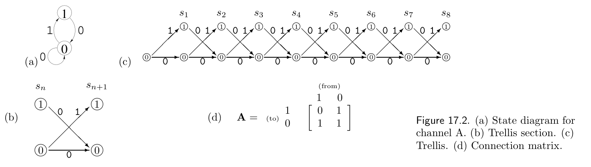
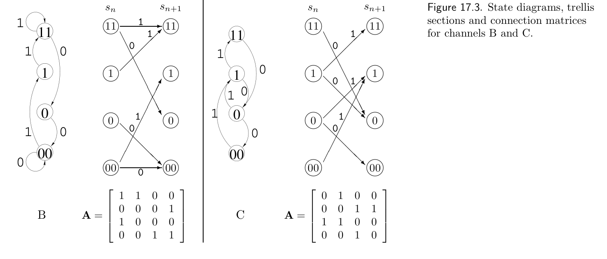

<!-- 源 PDF 物理页 263；原书印刷页 251。页首承接 17.2，页末续于 PDF 264。 -->

图 17.2　(a) 信道 A 的状态图。(b) 格形图的一段。(c) 格形图。(d) 连接矩阵。

**图内文字译注。**“from”表示转移前的状态（矩阵的列），“to”表示转移后的状态（矩阵的行）；$s_n$、$s_{n+1}$ 为相邻时刻的状态。圆圈内的 $0$、$1$ 是状态；箭头旁的 $0$、$1$ 是转移时发出的符号。矩阵按行、列状态 $1,0$ 排列，为 $\mathbf A=\begin{bmatrix}0&1\\1&1\end{bmatrix}$。

图 17.3　信道 B 和 C 的状态图、格形图段及连接矩阵。

**图内文字译注。**左侧 B、右侧 C 分别表示信道 B 和信道 C。圆圈中的 $11,1,0,00$ 为各信道状态，箭头旁的 $0,1$ 为发出的符号；$s_n$、$s_{n+1}$ 表示相邻时刻。两图下方的连接矩阵均按行、列状态 $11,1,0,00$ 排列。B 的矩阵为 $\mathbf A=\begin{bmatrix}1&1&0&0\\0&0&0&1\\1&0&0&0\\0&0&1&1\end{bmatrix}$；C 的矩阵为 $\mathbf A=\begin{bmatrix}0&1&0&0\\0&0&1&1\\1&1&0&0\\0&0&1&0\end{bmatrix}$。

因此，在本章中，我们用 $M_N$ 表示长度为 $N$ 的可区分消息的数目，并将容量定义为

$$C=\lim_{N\to\infty}\frac{1}{N}\log M_N.\tag{17.10}$$

算出一个信道的容量后，我们再来为该信道构造实用的码。

## 17.3　计算可能消息的数目

先介绍受约束信道的几种表示方法。在*状态图*中，发射机的各个状态用圆圈表示，圈内标出状态名称。从一个状态指向另一个状态的有向边表示发射机可以从前一状态转移到后一状态；边上的标记表示转移时发出的符号。图 17.2a 给出信道 A 的状态图。它有 $0$ 和 $1$ 两个状态。转移到状态 $0$ 时发出 $0$；转移到状态 $1$ 时发出 $1$；从状态 $1$ 转移到状态 $1$ 则不可能。

我们还可以用*格形图的一段*表示状态图，它把时间上相邻的两个状态画在两个相邻的水平位置上（图 17.2b）。发射机在时刻 $n$ 的状态记为 $s_n$。可能的状态序列可以用*格形图*表示，如图 17.2c 所示。一个有效序列对应格形图中的一条路径，有效序列数等于路径数。
