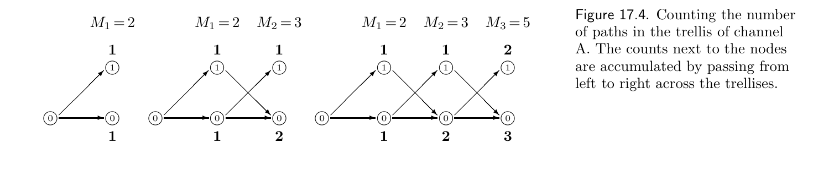
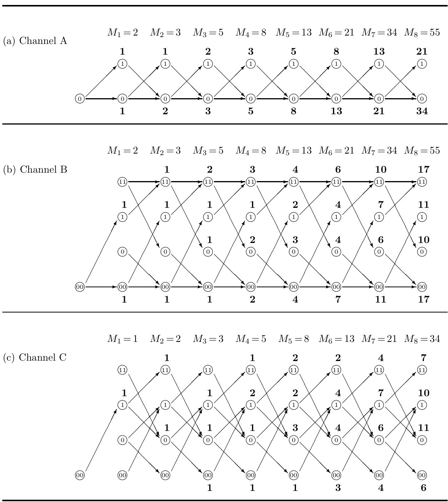

<!-- 源 PDF 物理页 264；原书印刷页 252。本页正文仅含图 17.4、17.5。 -->

图 17.4　计算信道 A 的格形图中路径的数目。沿格形图从左向右推移，就会得到各节点旁标出的累计路径数。

**图内文字译注。**三个图依次给出传输 $1$、$2$、$3$ 个符号后的路径数，分别为 $M_1=2$、$M_2=3$、$M_3=5$。圈内 $0$、$1$ 为状态，圈旁加粗的数字为到达该节点的路径数。

图 17.5　计算信道 A、B、C 的格形图中的路径数。假定初始时第一个比特之前是 $00$，因此对于信道 A 和 B，首个字符可以任取；但对于信道 C，首个字符必须是 $1$。

**图内文字译注。**(a)“Channel A”为“信道 A”，(b)“Channel B”为“信道 B”，(c)“Channel C”为“信道 C”。每列上方的 $M_1,\ldots,M_8$ 是相应长度的有效消息总数；圈内的 $0,1,00,11$ 是状态，圈旁的加粗数字为到达该状态的路径数。图 (a)、(b) 的总数均依次为 $2,3,5,8,13,21,34,55$；图 (c) 为 $1,2,3,5,8,13,21,34$。
