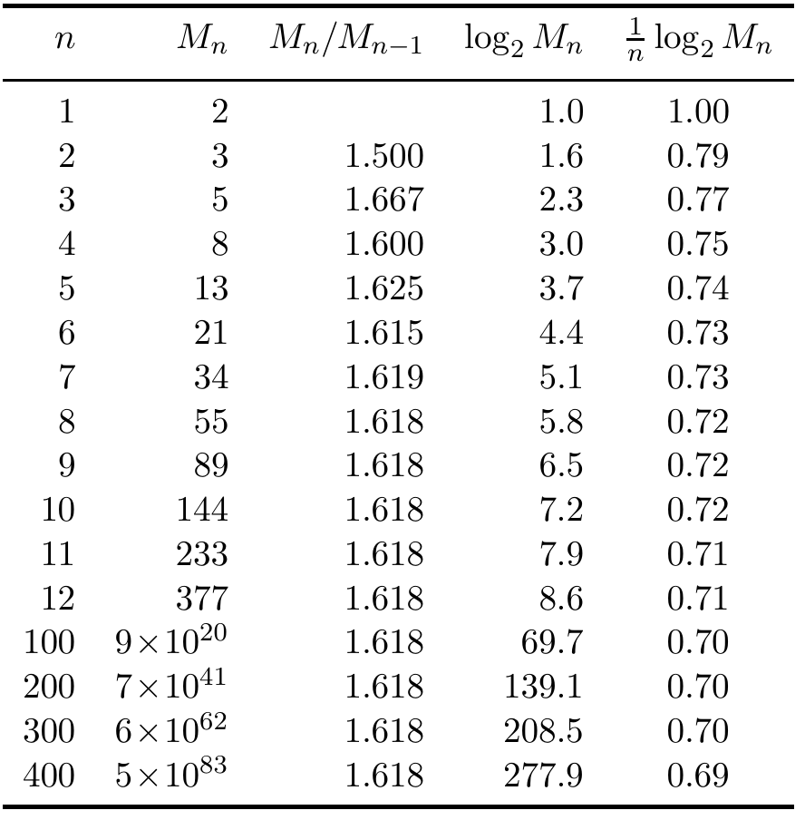

<!-- 源 PDF 物理页 265；原书印刷页 253。页首承接 PDF 263 的段落；图 17.6 为原书中的数据图。 -->

图 17.6　计算信道 A 的格形图中的路径数。

**图内文字译注。**列标题依次为：路径长度 $n$、有效路径数 $M_n$、相邻路径数之比 $M_n/M_{n-1}$、总信息量 $\log_2M_n$、每个信道周期的信息量 $\frac{1}{n}\log_2M_n$。表中 $n=1$ 的相邻比值原页留空；$n=100,200,300,400$ 的路径数以近似科学记数法列出。

为了计算穿过格形图的路径数，我们可以忽略边上的标记，用*连接矩阵* $\mathbf A$ 概括格形图的一段：如果有一条从状态 $s$ 到状态 $s'$ 的边，则 $A_{ss'}=1$；否则 $A_{ss'}=0$（图 17.2d）。图 17.3 给出信道 B 和 C 的状态图、格形图段与连接矩阵。

我们来通过格形图中的消息传递计算信道 A 的路径数。图 17.4 给出计数过程最初的几步；图 17.5a 给出 $n=1,\ldots,8$ 步后终止于各个状态的路径数。长度为 $n$ 的路径总数 $M_n$ 列在图的上方。我们认出，$M_n$ 构成 Fibonacci 数列。

▷ **习题 17.6**〔难度 1〕证明 Fibonacci 数列相邻两项的比值趋于黄金比例

$$\gamma\equiv\frac{1+\sqrt5}{2}=1.618.\tag{17.11}$$

因此，在一个常数因子之内，当 $N\to\infty$ 时，$M_N$ 按 $M_N\sim\gamma^N$ 增长；所以信道 A 的容量为

$$C=\lim_{N\to\infty}\frac{1}{N}\log_2[\text{constant}\cdot\gamma^N]=\log_2\gamma=\log_2 1.618=0.694.\tag{17.12}$$

怎样概括我们刚才的计算？路径数构成一个向量 $\mathbf c^{(n)}$；由 $\mathbf c^{(n)}$ 可以求出 $\mathbf c^{(n+1)}$：

$$\mathbf c^{(n+1)}=\mathbf A\mathbf c^{(n)}.\tag{17.13}$$

因此

$$\mathbf c^{(N)}=\mathbf A^N\mathbf c^{(0)},\tag{17.14}$$

其中 $\mathbf c^{(0)}$ 是尚未传输任何符号时各状态的路径数。在图 17.5 中，我们假定 $\mathbf c^{(0)}=[0,1]^{\mathsf T}$，即一开始两个符号都允许。路径总数为 $M_n=\sum_s c_s^{(n)}=\mathbf c^{(n)}\cdot\mathbf n$。在极限下，$\mathbf c^{(N)}$ 将由 $\mathbf A$ 的主右特征向量主导：

$$\mathbf c^{(N)}\longrightarrow\text{constant}\cdot\lambda_1^N\mathbf e_{\mathrm R}^{(0)}.\tag{17.15}$$
