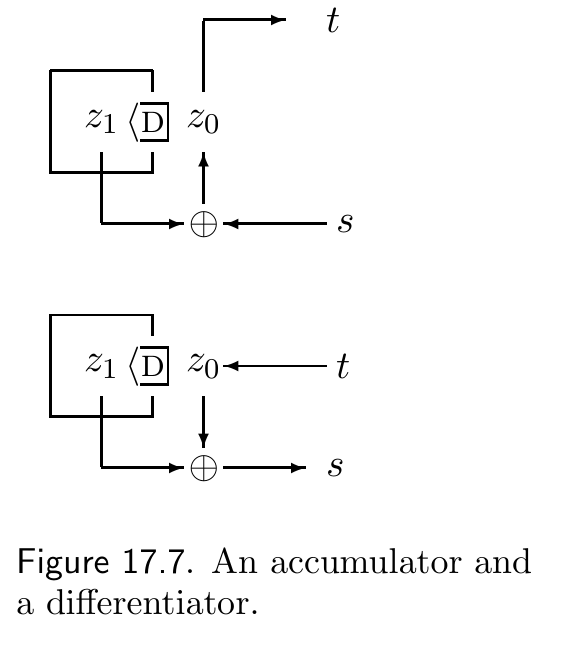

<!-- 源 PDF 物理页 266；原书印刷页 254。 -->

这里，$\lambda_1$ 是 $\mathbf A$ 的主特征值。

因此，要找出任意受约束信道的容量，我们只需算出其连接矩阵的主特征值 $\lambda_1$。于是

$$C=\log_2\lambda_1.\tag{17.16}$$

## 17.4　回到示例信道

比较图 17.5a 与图 17.5b、c，信道 B 和 C 看起来与信道 A 有相同的容量。三个格形图的主特征值确实相同（信道 A 和 B 的特征向量见原书第 608 页表 C.4 底部）。事实上，这些信道彼此密切相关。

### *信道 A 和 B 的等价性*

取信道 A 的任意有效比特串 $\mathbf s$，将它送入一个*累加器*，得到由下式定义的 $\mathbf t$：

$$\begin{aligned}t_1&=s_1,\\t_n&=t_{n-1}+s_n\pmod 2\qquad\text{当 }n\geq2,\end{aligned}\tag{17.17}$$

那么得到的比特串就是信道 B 的有效比特串，因为 $\mathbf s$ 中没有 $11$，所以 $\mathbf t$ 中不会有孤立的数字。累加器是可逆运算，因此，同样地，信道 B 的任意有效比特串 $\mathbf t$ 都能通过*二元差分器*映射成信道 A 的有效比特串 $\mathbf s$：

$$\begin{aligned}s_1&=t_1,\\s_n&=t_n-t_{n-1}\pmod 2\qquad\text{当 }n\geq2.\end{aligned}\tag{17.18}$$

由于在模 $2$ 运算中加法与减法等价，差分器也是一个模糊器：它用滤波器 $(1,1)$ 对信源比特流做卷积。

信道 C 也与信道 A 和 B 密切相关。

图 17.7　累加器与差分器。

**图内文字译注。**上图是累加器，输入为 $s$、输出为 $t$；下图是差分器，输入为 $t$、输出为 $s$。$\oplus$ 表示模 $2$ 相加，$\mathrm D$ 表示一个时间步的延迟，$z_0$、$z_1$ 是相邻状态。

▷ **习题 17.7**〔难度 1；解答见原书印刷页 257〕信道 C 与信道 A 和 B 有什么关系？

## 17.5　在受约束信道上的实际通信

那么，实际该怎么做？既然这三个信道等价，我们就可以集中研究信道 A。

### *定长方案*

先从显式列举的码入手。表 17.8 中的码可达到 $3/5=0.6$ 的传输率。

表 17.8　信道 A 的一个游程长度受限码。

| $s$ | $c(s)$ |
| ---: | :--- |
| 1 | 00000 |
| 2 | 10000 |
| 3 | 01000 |
| 4 | 00100 |
| 5 | 00010 |
| 6 | 10100 |
| 7 | 01010 |
| 8 | 10010 |

▷ **习题 17.8**〔难度 1；解答见原书印刷页 257〕类似地，列出所有以状态 $0$ 结束的长度为 $8$ 的比特串（共有 $34$ 个）。由此说明，我们能把 $5$ 个信源比特（$32$ 个信源比特串）映射为 $8$ 个传输比特，达到 $5/8=0.625$ 的传输率。如果把整数个信源比特映射为 $N=16$ 个传输比特，可以达到多高的传输率？
