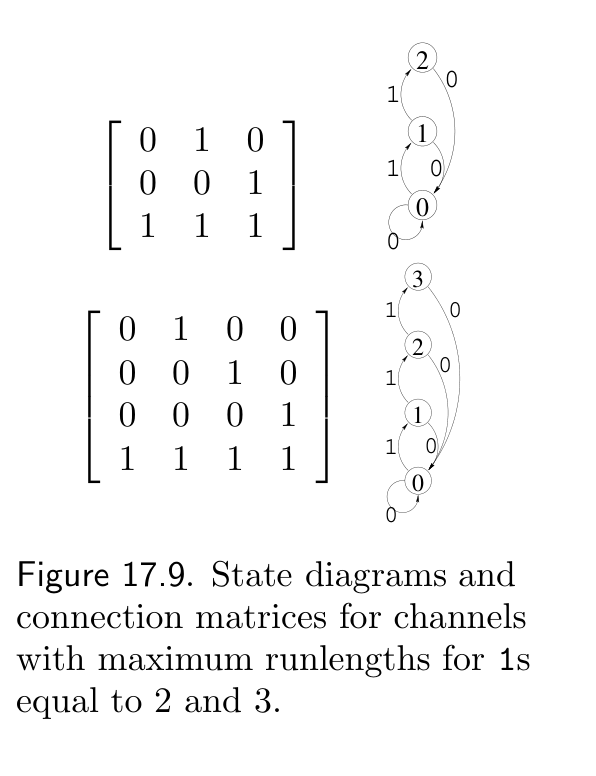

<!-- 源 PDF 物理页 267；原书印刷页 255。原页图号先出现 17.9，图 17.8 位于后页。 -->

### *最优的变长方案*

在受约束信道上传递信息的最优方法，是求出格形图各点的最优转移概率 $Q_{s'\mid s}$，再按这些概率进行状态转移。

讨论信道 A 时，我们已经说明：用密度 $f=0.38$ 的稀疏信源驱动码 $C_2$，即可达到容量。我们也知道怎样制作稀疏化器（第 6 章）：设计一个在压缩稀疏信源时最优的算术码，它所对应的译码器便能把密集的比特串（即随机二元比特串）最优地映射成稀疏比特串。

最优概率的求法留作习题。

**习题 17.9**〔难度 3〕证明最优转移概率 $\mathbf Q$ 可按以下步骤求出。

求出 $\mathbf A$ 的主右特征向量和主左特征向量，即对应最大特征值 $\lambda$、满足 $\mathbf A\mathbf e^{(\mathrm R)}=\lambda\mathbf e^{(\mathrm R)}$ 及 $(\mathbf e^{(\mathrm L)})^{\mathsf T}\mathbf A=\lambda(\mathbf e^{(\mathrm L)})^{\mathsf T}$ 的解。然后构造一个矩阵 $\mathbf Q$，其不变分布正比于 $e_i^{(\mathrm R)}e_i^{(\mathrm L)}$，即

$$Q_{s'\mid s}=\frac{e_{s'}^{(\mathrm L)}A_{s's}}{\lambda e_s^{(\mathrm L)}}.\tag{17.19}$$

［提示：习题 16.2（原书印刷页 245）或许能在这里提供有益的启发。］

▷ **习题 17.10**〔难度 3；解答见原书印刷页 258〕证明用最优转移概率矩阵 (17.19) 生成序列时，所得序列的熵渐近地达到每个符号 $\log_2\lambda$。［提示：假定前一个符号服从不变分布，考虑给定前一个符号时单个符号的条件熵。］

在实际应用中，我们很可能会采用最优变长方案的有限精度近似。有时人们不喜欢变长方案，因为在具体情况下，编码后的实际长度无法预先确定。某些应用可能希望得到保证：一个大小为 $N$ 比特的信源文件，编码长度小于某个给定值，例如 $N/(C+\epsilon)$。例如，如果所有 $512$ 字节的块都恰好占用相同大小的磁盘空间，磁盘驱动器就更容易管理。对于某些受约束信道，我们可以简单地修改变长编码，给出这样的保证，方法如下：找出两个码，也就是两种将二元比特串映射为变长编码的方式，使得对任意信源比特串 $\mathbf x$，如果第一个码对 $\mathbf x$ 的编码短于平均长度，那么第二个码对它的编码就长于平均长度，*反之亦然*。要传输比特串 $\mathbf x$，就用两个码分别对整个比特串编码，发送较短的那个，并在前面加上一个经过适当编码的比特，以指明使用的是哪一个码。

图 17.9　$1$ 的最大游程长度分别为 $2$ 和 $3$ 的两个信道的状态图及连接矩阵。

**图内文字译注。**上图的状态 $0,1,2$ 分别记录连续出现的 $1$ 的数目，连接矩阵为 $\begin{bmatrix}0&1&0\\0&0&1\\1&1&1\end{bmatrix}$；下图另加状态 $3$，连接矩阵为 $\begin{bmatrix}0&1&0&0\\0&0&1&0\\0&0&0&1\\1&1&1&1\end{bmatrix}$。箭头旁的 $0$、$1$ 表示转移时发出的比特。

▷ **习题 17.11**〔难度 3C；解答见原书印刷页 258〕对于图 17.9 所示的两个游程长度受限信道，以 $0$ 开头的长度为 $8$ 的有效序列各有多少个？这些信道的容量各是多少？使用计算机，求出用于在信道 A 以及图 17.9 中两个游程长度受限信道的格形图上生成随机路径的矩阵 $\mathbf Q$。
