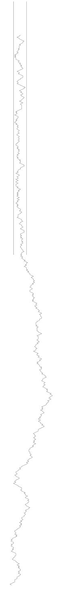

<!-- 源 PDF 物理页 269；原书印刷页 257。含未编号连接矩阵与 17.7 节前三道习题解答。 -->

**习题 17.14**〔难度 4〕对于英语（例如采用图 2.1 的概率分布），摩尔斯码的设计有多合理？

**习题 17.15**〔难度 3C〕把 DNA 放进一根窄管有多难？

对信息论研究者来说，与受约束信道相关的熵揭示了该信道能传递多少信息。在统计物理中，人们出于另一个原因做同样的计算，例如预测聚合物的热力学性质。

举一个简化例子：考虑长度为 $N$ 的聚合物，它可以处在宽度为 $L$ 的约束管中，也可以处在不受约束的开放空间。在开放空间中，聚合物从一维随机游走的集合中随机取一种状态，例如每一步有 $3$ 种可能的方向。该游走每一步的熵为 $\log 3$，总熵为 $N\log 3$。［聚合物的自由能定义为这个数值的 $-kT$ 倍，其中 $T$ 是温度。］在管内，聚合物的一维游走仍可沿 $3$ 个方向前进，除非被管壁挡住。因此，当 $L=10$ 时，连接矩阵例如为

$$\begin{bmatrix}
1&1&0&0&0&0&0&0&0&0\\
1&1&1&0&0&0&0&0&0&0\\
0&1&1&1&0&0&0&0&0&0\\
0&0&1&1&1&0&0&0&0&0\\
0&0&0&1&1&1&0&0&0&0\\
&&&&\ddots&\ddots&\ddots&&&\\
0&0&0&0&0&0&0&1&1&1\\
0&0&0&0&0&0&0&0&1&1
\end{bmatrix}.$$

那么，聚合物的熵是多少？聚合物进入管道所引起的*熵变化*是多少？如果可能，求出它关于 $L$ 的表达式。用计算机求出某个特定 $L$ 值（例如 $20$）对应的游走熵，并画出聚合物在管内横向位置的概率密度。

注意，一个受约束信道与一个无约束信道的容量之差，正比于把 DNA 拉进管道所需的力。

图 17.10　被挤入窄管的 DNA 模型。DNA 倾向于从管中弹出，因为在管外，它的随机游走具有更高的熵。

## 17.7　解答

**习题 17.5 的解答**（原书印刷页 250）。由码 $C_2$ 传输的文件中，平均有三分之一的 $1$ 和三分之二的 $0$。

若 $f=0.38$，则 $1$ 的比例为 $f/(1+f)=(\gamma-1.0)/(2\gamma-1.0)=0.2764$。

**习题 17.7 的解答**（原书印刷页 254）。要从信道 A 的一个有效比特串得到信道 C 的有效比特串，先将各比特取反［$1\to0$；$0\to1$］，再送入累加器。这两个运算都可逆，所以信道 C 的任何有效比特串也可以映射为信道 A 的有效比特串。唯一需要注意的是边界效应。如果我们假定，信道 C 传输的首个字符前面是一串 $0$，于是首个字符必定为 $1$（图 17.5c），那么只有再假定信道 A 的首个字符必须为 $0$，这两个信道才完全等价。

**习题 17.8 的解答**（原书印刷页 254）。当传输比特数 $N=16$ 时，能够编码的信源比特数最多为整数 $10$；所以长度为 $N=16$ 的定长码，其最大传输率是 $0.625$。
