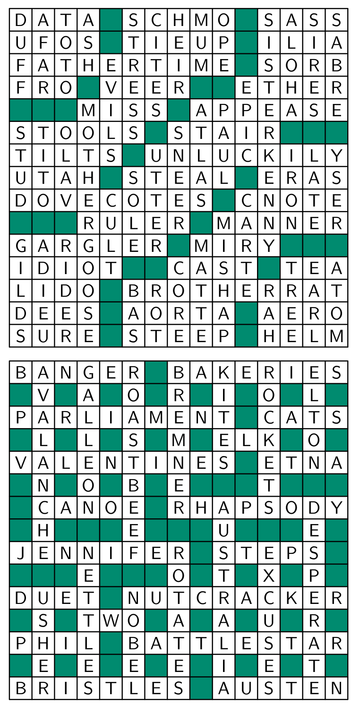

<!-- 源 PDF 物理页 272；原书印刷页 260。图 18.1 为英语填字格，格内字母本身是原书讨论的约束数据。 -->

# 第 18 章　填字游戏与密码破解

> **编者导读（非原书正文）**　本章从英语填字游戏出发，讨论语言的冗余度、词频分布和语言模型，再用这些模型分析密码破解问题。

本章将随机漫步般地讨论几个与语言建模有关的话题。

## 18.1　填字游戏

填字游戏的编制规则可以看作定义了一条受约束信道。能够编出*许多*有效的填字游戏，说明这条受约束信道的容量大于零。

填字游戏有两种典型形式。在 A 型（美式）填字游戏中，每一行、每一列都是一串长度不小于 $2$ 的单词，相邻单词之间隔着一个或多个空格。在 B 型（英式）填字游戏中，每一行、每一列由单词和单个字符混合组成，彼此之间也隔着一个或多个空格，而且每个字符都属于至少一个单词（横向或纵向）。A 型填字游戏的每个字母都*同时*属于一个横向单词和一个纵向单词；典型 B 型填字游戏中，大约只有一半字母如此，其余字母只属于一个单词。

图 18.1　A 型（美式，上）和 B 型（英式，下）填字游戏。深绿色格表示单词之间的空格。格内保留原书的英文字母：这些字母及其交叉排列是图示的数据，逐格替换成汉字会改变所讨论的约束。

A 型填字游戏不允许出现单个字符，因而比 B 型更难*编制*。B 型通常更难*解*，因为每个字符受到的约束更少。

### *为什么能编出填字游戏？*

如果一种语言没有冗余，那么在方格中随意写入字母，都能构成有效的填字游戏。反过来，如果一种语言的冗余度很高，就很难编出填字游戏（也许只有少量平凡的例外）。因此，能够用一种语言编出填字游戏，便表明这种语言的*冗余度存在一个界限*。填字游戏通常不用真正的英语来编，而是用“词英语”（word-English）：这种语言由词典中的单词串组成，单词之间以空格分隔。

▷ **习题 18.1**〔难度 2〕估计词英语的容量，单位是每字符的比特数。［提示：把词英语看成一条受约束信道（第 17 章），并参见习题 6.18（原书第 125 页）。］

能编出许多填字游戏这一事实，为词英语的熵给出了一个下界。

为简化讨论，现在用第 4.1 节引入的 Wenglish 来建立词英语模型：这是一种由 $W$ 个单词组成的语言，每个单词的长度都是 $L$。把单词之间的空格也算进去，这种语言每字符的熵为

$$H_{\rm W}\equiv\frac{\log_2 W}{L+1}.\tag{18.1}$$
