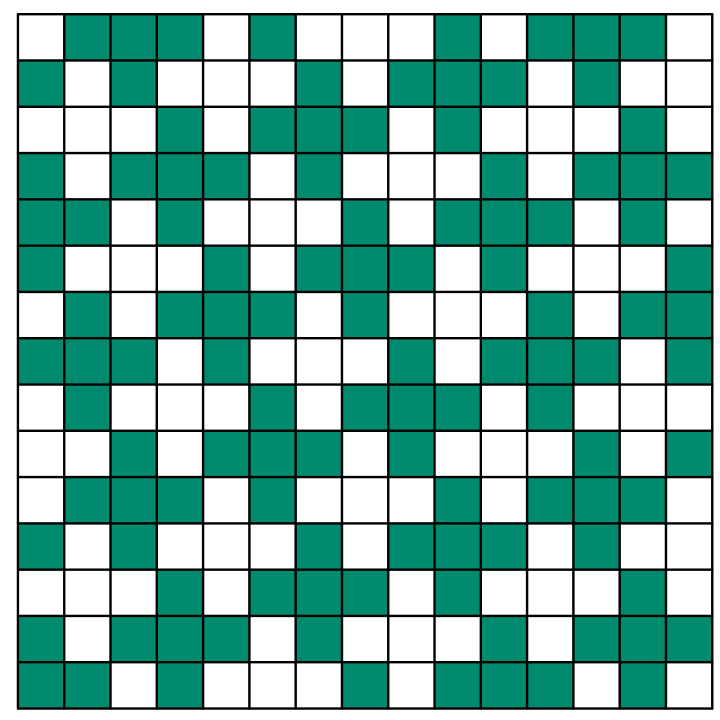
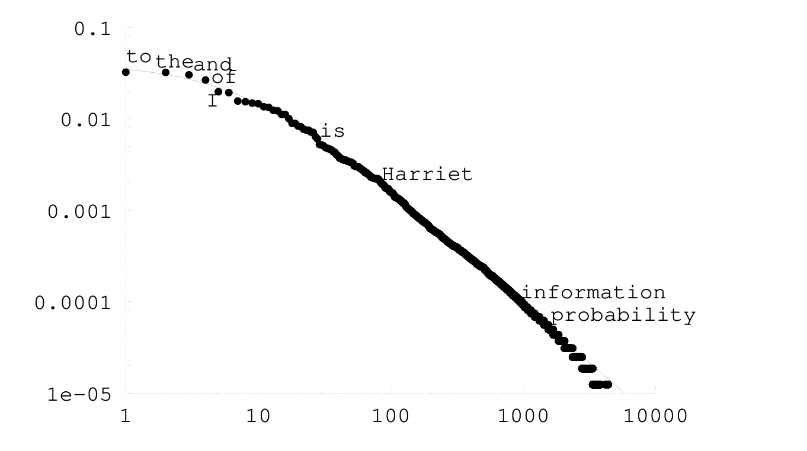

<!-- 源 PDF 物理页 274；原书印刷页 262。图 18.3、18.4 均由原页对应图形单独裁取。 -->

### 延伸阅读

关于填字游戏的上述观察最早由 Shannon（1948）提出；我是从 Wolf 和 Siegel（1998）那里了解到它们的。这个话题与二维受约束信道的容量密切相关。包裹上常见的二维条码，就是一种二维受约束信道的例子。

▷ **习题 18.2**〔难度 3〕一种二维信道规定：在 $N\times N$ 的矩形网格中，每个内部像素的八个相邻像素里，必须有四个黑色、四个白色。［边界像素周围的黑白像素数不受约束。］图 18.3 给出一个满足这一约束的二元图案。当 $N$ 很大时，这条信道的容量是多少比特／像素？

图 18.3　每个内部像素都与四个黑色像素和四个白色像素相邻的二元图案。原图中的深绿色格表示黑色像素，白格表示白色像素。

## 18.2　简单语言模型

### *齐普夫—曼德尔布罗特分布*

最粗略的语言模型是“一元”模型：连续出现的每个词，都独立地从一个词的概率分布中抽取。这个词频分布是什么样的？

齐普夫定律（Zipf, 1949）认为，一种语言中概率排在第 $r$ 位的词，其概率近似为

$$P(r)=\frac{\kappa}{r^\alpha},\tag{18.9}$$

其中指数 $\alpha$ 接近 $1$，$\kappa$ 是常数。按照齐普夫定律，在双对数坐标上绘出词频与词的排名，应得到一条斜率为 $-\alpha$ 的直线。

曼德尔布罗特（1982）对齐普夫定律的修正引入了第三个参数 $v$，认为概率应为

$$P(r)=\frac{\kappa}{(r+v)^\alpha}.\tag{18.10}$$

对于简·奥斯汀的 *Emma* 等一些文献，齐普夫—曼德尔布罗特分布拟合得很好，见图 18.4。

另一些文献的词频分布则没有这样好的拟合。图 18.5 绘出本书 LaTeX 源文件的词频与排名。总体看，图形近似一条直线，但仍可看出弯曲。公平地说，这份源文件并非纯英语：其中混有英语、诸如 “$x$” 的数学符号，以及 LaTeX 命令。

图 18.4　齐普夫—曼德尔布罗特分布式 (18.10) 的曲线，与简·奥斯汀 *Emma* 中词语经验频率的点图之间的拟合。横轴是按频率排列的词序号，纵轴是概率，两轴均为对数刻度。拟合参数为 $\kappa=0.56$、$v=8.0$、$\alpha=1.26$。图内标出的英文词例 `to`、`the`、`and`、`of`、`I`、`is`、`Harriet`、`information`、`probability` 分别是“到／向”“这／该”“和”“……的”“我”“是”“哈丽雅特”“信息”“概率”。
