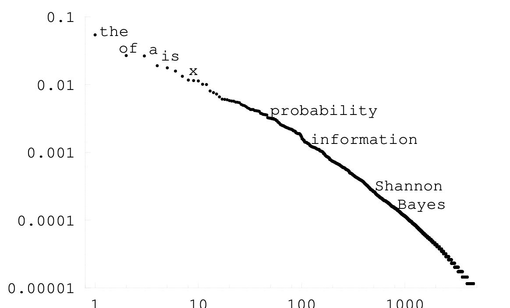
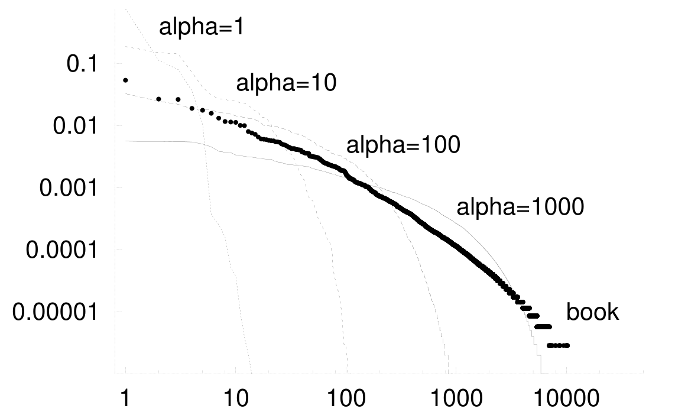

<!-- 源 PDF 物理页 275；原书印刷页 263。图 18.5、18.6 均按原页独立裁图。 -->

图 18.5　本书 LaTeX 源文件中，词的出现频率与排名之间关系的双对数图。图内词例 `the`、`of`、`a`、`is`、`probability`、`information`、`Shannon`、`Bayes` 依次为英语定冠词、“……的”、英语不定冠词、“是”、“概率”、“信息”、“香农”、“贝叶斯”；`x` 是数学符号。

图 18.6　四种由狄利克雷过程随机生成的“语言”的齐普夫图，参数 $\alpha$ 从 $1$ 到 $1000$；另附本书的齐普夫图供比较。图内 `alpha=1`、`alpha=10`、`alpha=100`、`alpha=1000` 分别标示四条模拟曲线的参数值；`book` 表示“本书”。横轴为频率排名，纵轴为符号频率，均使用对数刻度。

### *狄利克雷过程*

假设我们想为语言建立一元模型，应该用哪一种？语言建模的一项难点是词汇量没有固定上限。观察到的语言样本越大，遇到的不同单词就越多。语言的生成模型应当体现这一性质。如果有人问“新发现的一部莎士比亚作品的下一个词是什么？”，我们给出的词概率分布，显然应当对*莎士比亚从未使用过的词*也赋予非零概率。语言的一元生成模型还应满足一条称为*可交换性*（exchangeability）的一致性规则。设想用这个模型生成一种新的语言，得到一个不断增长的文本语料库；文本的各项统计性质应处处一致：在文本流的任一位置找到某个特定单词的概率，应与其他位置相同。

狄利克雷过程模型描述一条符号流（我们把符号看作“单词”），它满足可交换性规则，也允许符号词汇表无限增长。这个模型只有一个参数 $\alpha$。随着符号流生成，我们用唯一的整数 $w$ 标识每个新符号。在已经观察到长度为 $F$ 的符号流后，用迄今所见各符号的计数 $\{F_w\}$ 来定义下一个符号的概率：下一个符号是一个以前从未见过的新符号，其概率为

$$\frac{\alpha}{F+\alpha}.\tag{18.11}$$

下一个符号是符号 $w$ 的概率为

$$\frac{F_w}{F+\alpha}.\tag{18.12}$$

图 18.6 给出用不同 $\alpha$ 值（从 $1$ 到 $1000$）的狄利克雷过程先验生成、各有一百万个符号的“文档”的齐普夫图，即符号频率对排名的图。

显然，狄利克雷过程不能恰当地模拟那些观测到的、粗略服从齐普夫定律的分布。
