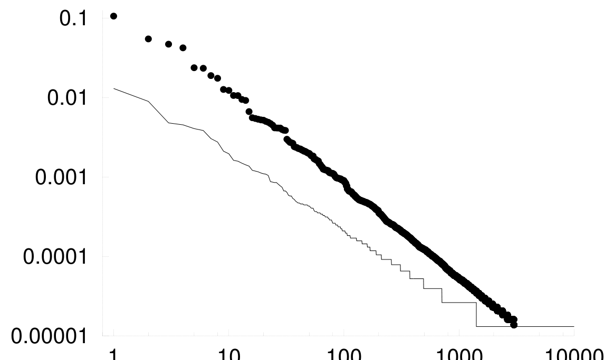

<!-- 源 PDF 物理页 276；原书印刷页 264。图 18.7 按原页图形裁取；表 18.8 接续于 PDF 277。 -->

图 18.7　先用参数 $\alpha=2$ 的狄利克雷过程依次生成字符，再选其中一个字符作为空格，由此得到两种“语言”的词频排名图。两条曲线对应两种不同的空格字符选择；横轴为词频排名，纵轴为词频，均使用对数刻度。

不过，稍作调整，狄利克雷过程就能产生相当漂亮的齐普夫图。设想用参数 $\alpha$ 较小的狄利克雷过程生成由基本符号组成的语言，使出现频率较高的符号约有 $27$ 个。再把其中一个符号（此时称为“字符”，而不是“单词”）指定为空格，就可以把相邻空格之间的字符串视为“单词”。这样生成的语言，其词频通常会形成图 18.7 那样漂亮的齐普夫图。选哪个字符作为空格，决定了齐普夫图的斜率：空格字符的概率越低，生成的语言就越丰富，斜率也越平缓。

## 18.3　信息量的单位

对于发生概率为 $P(x)$ 的结果 $x$，它的信息量定义为

$$h(x)=\log\frac{1}{P(x)}.\tag{18.13}$$

一个系综的熵是其平均信息量：

$$H(X)=\sum_x P(x)\log\frac{1}{P(x)}.\tag{18.14}$$

依据数据比较多个假设时，通常便于比较各个备选假设下数据的概率的对数。“支持假设 $\mathcal H_i$ 的对数证据”为

$$\text{“支持 }\mathcal H_i\text{ 的对数证据”}=\log P(D\mid\mathcal H_i),\tag{18.15}$$

如果只比较两个假设，就可以计算“对数优势比”：

$$\log\frac{P(D\mid\mathcal H_1)}{P(D\mid\mathcal H_2)},\tag{18.16}$$

它也被称为“支持 $\mathcal H_1$ 的证据权重”。一个假设的对数证据 $\log P(D\mid\mathcal H_i)$，是数据 $D$ 的信息量的负值：如果在某个假设下，数据的信息量很大，这些数据对该假设而言就很意外；如果另一个假设没有那么意外，后一个假设就会变得更可信。“信息量”“惊讶值”与对数似然或对数证据是一回事。

这些量都是概率的对数，或概率对数的加权和，因此可以用相同的单位计量。单位取决于对数底数的选择。

这些单位的名称列在表 18.8 中。
