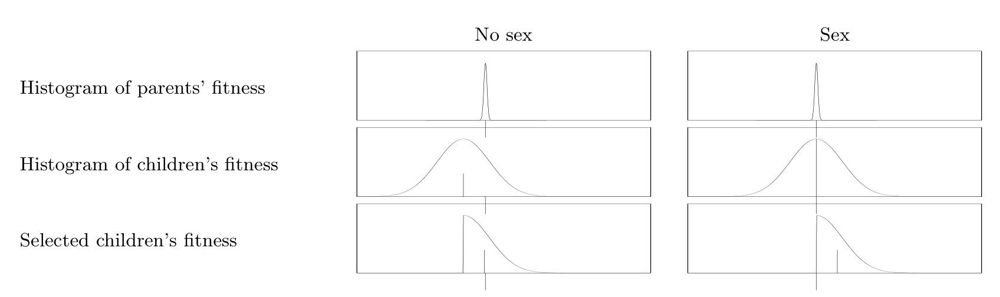

<!-- 源 PDF 物理页 285；原书印刷页 273。页首式 (19.12) 的续句已并入 PDF 284。式 (19.14) 后原书给出的积分常数按原页保留，未自行调整。 -->

图 19.1　为什么有性生殖优于无性繁殖。图内 “No sex”“Sex” 分别表示“无性生殖”“有性生殖”；从上至下的 “Histogram of parents’ fitness”“Histogram of children’s fitness”“Selected children’s fitness” 分别表示“亲本适应度直方图”“子代适应度直方图”“被选中子代的适应度”。若用突变在子代之间制造变异，子代的平均适应度必然低于亲本；变异越大，平均值的下降越多。选择再把平均适应度抬高。相比之下，重组可以在不降低平均适应度的情况下产生变异。典型的变异幅度按 $\sqrt G$ 增长，其中 $G$ 是基因组的大小，因此选择后平均适应度提高 $O(\sqrt G)$。

这个理论有些不准确：真实的适应度概率分布并非高斯分布，而是不对称的，并且被量化为整数。尽管如此，这一理论的预测与下述模拟结果的差异并不大。

### *有性生殖理论*

借助两个近似，有性种群的分析就变得可行。第一，我们假设基因库混合得足够快，以致可以忽略基因之间的相关性；第二，我们假设*均一性*（homogeneity），即处于好状态的第 $g$ 个比特所占比例 $f_g$，对所有 $g$ 都相同，等于 $f(t)$。

在这些假设下，若两个适应度均为 $F=fG$ 的亲本交配，子代适应度的概率分布以亲本适应度 $F$ 为均值；有性生殖产生的变异不会降低平均适应度。子代适应度的标准差按 $\sqrt{Gf(1-f)}$ 增长。由于选择后的适应度增量与这一标准差成正比，因此*每代适应度的增长量按基因组大小的平方根 $\sqrt G$ 增长*。如框 19.2 所示，平均适应度 $\bar F=fG$ 遵循以下微分方程：

$$\frac{d\bar F}{dt}\simeq\eta\sqrt{f(t)(1-f(t))G},\tag{19.13}$$

其中 $\eta\equiv\sqrt{2/(\pi+2)}$。该方程的解为

$$\begin{aligned}f(t)&=\frac12\left[1+\sin\left(\frac{\eta}{\sqrt G}(t+c)\right)\right],\\ t+c&\in\left(-\frac{\pi\sqrt G}{2\eta},\frac{\pi\sqrt G}{2\eta}\right),\end{aligned}\tag{19.14}$$

其中 $c$ 是积分常数，$c=\sin^{-1}(2f(0)-1)$。所以，这个理想化系统会在有限时间内达到优生学意义上的完美状态（$f=1$）：所需时间为 $(\pi/\eta)\sqrt G$ 代。

### *模拟*

图 19.3a 显示一个有性种群的适应度：个体数 $N=1000$，基因组大小 $G=1000$，从归一化适应度为 $0.5$ 的随机初始状态出发。图中还画出了式 (19.14) 的理论曲线 $f(t)G$，与模拟结果非常吻合。

与此相对，图 19.3b、c 分别显示突变率为 $m=0.25/G$ 和 $m=6/G$ 时，由突变产生变异的种群的适应度变化。请注意，它们的横轴刻度与图 19.3a 不同。
