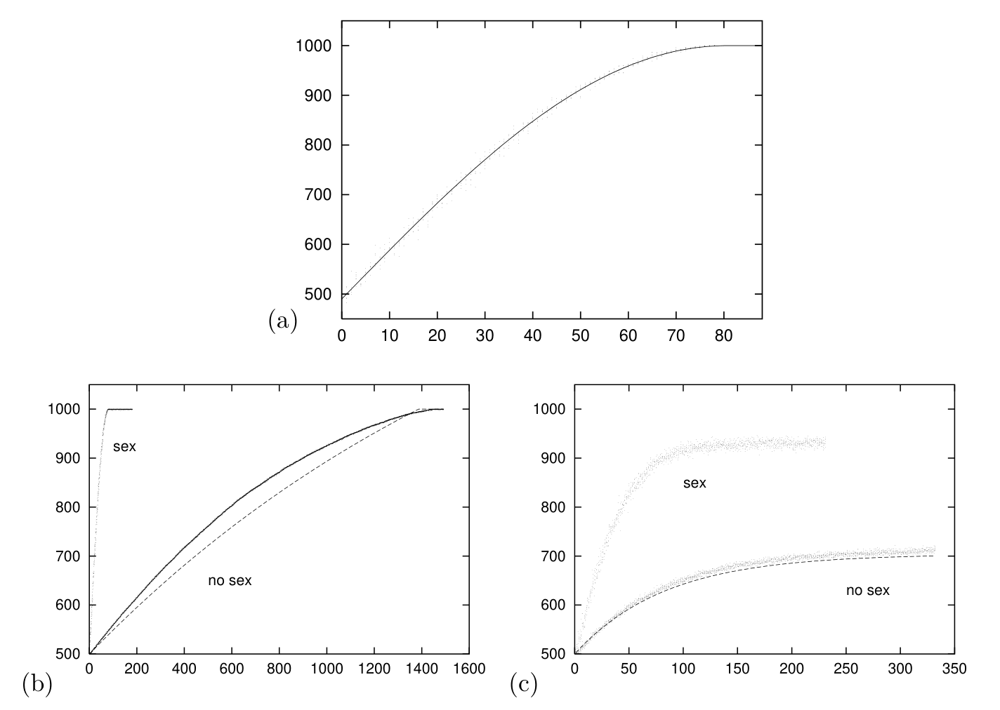
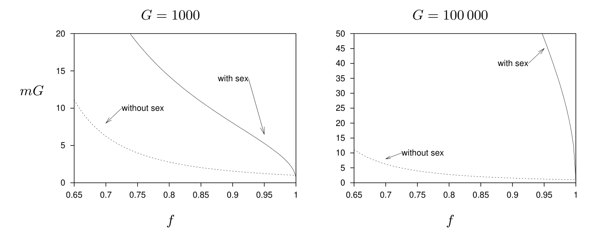

<!-- 源 PDF 物理页 287；原书印刷页 275。图 19.3 与图 19.4 各自整图裁出，图中英文在紧邻图注中翻译；本页式 (19.15) 的正值条件接续于 PDF 288。 -->

图 19.3　适应度随时间的变化。基因组大小 $G=1000$。图中的点表示每代从新生种群中随机抽出的六个个体的适应度。初始种群有 $N=1000$ 个个体，其随机生成的基因组满足 $f(0)=0.5$（精确等于该值）。(a) 变异只由有性生殖产生；实线表示无限大、均一种群的理论曲线，即式 (19.14)。(b)、(c) 变异由突变产生，分别比较有性和无性生殖；每个基因组的突变率分别为 $mG=0.25$（b）和 $mG=6$（c）个比特。虚线表示式 (19.12) 的曲线。图内 “sex”“no sex” 分别表示“有性生殖”“无性生殖”；横轴表示时间（代），纵轴表示适应度。

图 19.4　可承受的最大突变率，以每个基因组的错误数 $mG$ 表示，并与归一化适应度 $f=F/G$ 比较。左图的基因组大小为 $G=1000$，右图为 $G=100\,000$。与基因组大小无关，孤雌生殖物种（无性生殖）每个基因组每代只能承受数量级为 $1$ 的错误；采用重组（有性生殖）的物种则能承受高得多的突变率。图内 “with sex”“without sex” 分别表示“有性生殖”“无性生殖”；横轴为 $f$，纵轴为 $mG$。

**习题 19.1**［难度 3；解答见原书印刷页 280］**对种群规模的依赖。**　有性种群的结果怎样随种群规模变化？我们预计存在一个最小种群规模；高于这个规模，有性生殖理论才准确。这个最小种群规模与 $G$ 有什么关系？

**习题 19.2**［难度 3］**对交换机制的依赖。**　在简单的有性生殖模型中，每个比特都从两名亲本中的一名随机取得；换言之，我们允许任意两个相邻核苷酸之间以 $50\%$ 的概率发生交换。如果 (a) 交换概率较小；(b) 交换只发生在沿基因组每隔 $d$ 个比特出现的*热点*（hot spots）；模型会怎样改变？

## 19.3　可承受的最大突变率

如果将两种变异模型结合起来，会怎样？有性生殖的物种最多能承受多高的突变率？

适应度的增长率由下式给出：

$$\frac{df}{dt}\simeq-2m\delta f+\eta\sqrt2\sqrt{\frac{m+f(1-f)/2}{G}},\tag{19.15}$$
