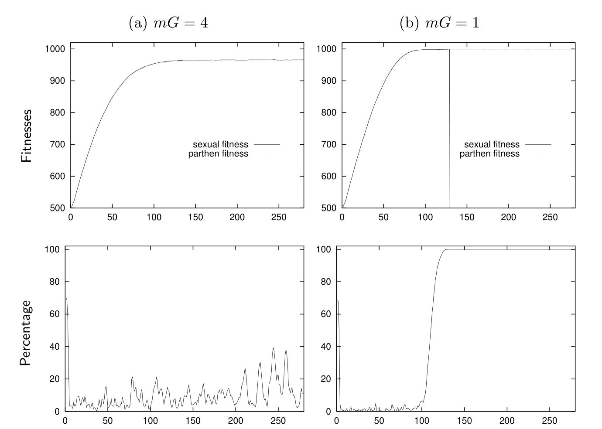

<!-- 源 PDF 物理页 290；原书印刷页 278。图 19.5 下方首段承接 PDF 289，已合并于前页，此处从下一原段继续。 -->

图 19.5　种群中含有孤雌生殖基因、两类个体之间不杂交、且单独生育的母体与有性生殖的一对亲本生育同样多子代时的结果。$G=1000$，$N=1000$。(a) $mG=4$；(b) $mG=1$。上排纵轴显示两个子种群的适应度，下排纵轴显示孤雌生殖个体在种群中所占的百分比。图内 “Fitnesses”“Percentage” 分别为“适应度”“百分比”，“sexual fitness”“parthen fitness” 分别为“有性生殖个体的适应度”“孤雌生殖个体的适应度”；横轴表示时间（代）。

在足够不稳定、适应度函数持续变化的环境中，孤雌生殖个体总会落后于有性生殖群体。这些结果与 Haldane 和 Hamilton（2002）的论点一致：在与寄生生物的军备竞赛中，有性生殖是有利的。寄生生物定义了一个随时间变化的有效适应度函数，而有性种群总能更快地沿当前适应度函数上升。

### *可加的适应度函数*

当然，我们的结果取决于假设的适应度函数和选择模型。把适应度一阶近似为若干独立项之和，合理吗？Maynard Smith（1968）认为合理：例如，好基因越多，一个个体在竞争等级中的位置就越高。定向选择模型已广泛用于理论种群遗传学研究（Bulmer, 1985）。我们可能预计，真实适应度函数会包含相互作用；在这种情况下，交换可能降低平均适应度。不过，重组给适应度函数可加的物种带来最大优势，因此可以预测：进化偏爱那些基因组表示方式所对应的适应度函数只含较弱相互作用的物种。即使存在相互作用，适应度仍可能由这些相互作用项相加而成；这些项的数量可能是基因组大小 $G$ 的某个比例。
