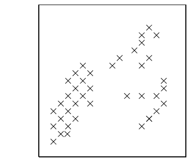

<!-- 源 PDF 物理页 297；原书印刷页 285。页首公式接续 PDF 296 末段的矢量量化定义。 -->

$$D=\sum_{\mathbf x}P(\mathbf x)\frac12\left[\mathbf m^{(k(\mathbf x))}-\mathbf x\right]^2.\tag{20.1}$$

[理想的目标函数应当使人对图像主观感受到的失真最小。由于人的感知失真很难量化，矢量量化与有损压缩不像数据建模与无损压缩那样，是定义十分明确的问题。]在矢量量化中，我们不一定认为模板 $\{\mathbf m^{(k)}\}$ 有什么天然含义；它们只是完成任务的工具。顺便指出，矢量量化的分配规则（即编码器），与纠错码译码时的译码问题颇为相似。

建立簇模型的第三个理由是：模型失效可能凸显值得特别留意的有趣对象。假如我们训练了一个矢量量化器，善于压缩海面卫星图像，那么，那些量化器不能很好压缩的图像块，也许恰恰含有船只！如果生物学家遇到一个绿色东西，却看见它跑开（或滑走），这与他认为绿色东西不会跑开的簇模型不符，就提示他特别留意它。人不能把全部时间都花在对各种事物感到惊奇上；簇模型有助于从周遭的大量事物中筛出真正值得注意的对象。

图 20.1　$N=40$ 个数据点。图中叉号逐一标出数据点。

喜欢聚类算法的第四个理由是：它们也许可以用来模拟神经系统中的学习过程。我们接下来讨论的 K 均值算法，就是一种*竞争性学习*算法。在这一算法中，$K$ 个簇相互竞争，争取拥有各个数据点。

## 20.1　K 均值聚类

K 均值算法将 $I$ 维空间中的 $N$ 个数据点划分为 $K$ 个簇。每个簇由一个称为其*均值*的向量 $\mathbf m^{(k)}$ 参数化。

> **关于名称……**　据我所知，K 均值聚类中的“K”，仅指选定的簇数。如果牛顿也遵循同样的命名原则，也许我们在学校学的会叫作“变量 $x$ 的微积分”。这是个傻名字，但我们只好沿用。

用 $\{\mathbf x^{(n)}\}$ 表示数据点，其中上标 $n$ 从 $1$ 到数据点总数 $N$。每个向量 $\mathbf x$ 有 $I$ 个分量 $x_i$。我们假设 $\mathbf x$ 所在空间是实空间，并且已有一个定义点与点之间距离的度量，例如：

$$d(\mathbf x,\mathbf y)=\frac12\sum_i(x_i-y_i)^2.\tag{20.2}$$

开始运行 K 均值算法（算法 20.2）时，要以某种方式初始化 $K$ 个均值 $\{\mathbf m^{(k)}\}$，例如赋予随机值。此后，K 均值按两个步骤迭代。在*分配步骤*中，把每个数据点 $n$ 分配给最近的均值；在*更新步骤*中，调整各均值，使其等于所负责数据点的样本均值。

图 20.3 用一个简单的二维数据集演示 K 均值算法，其中使用两个均值。数据点归属哪个簇，由两种不同的点符号表示；两个均值则以圆圈标出。算法经过三次迭代后收敛：此时分配不再改变，更新时均值也就不再移动。K 均值算法总会收敛到一个不动点。
