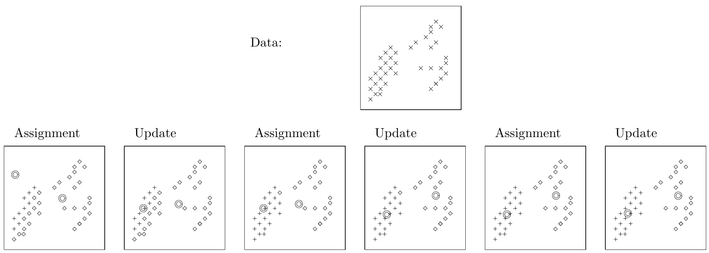
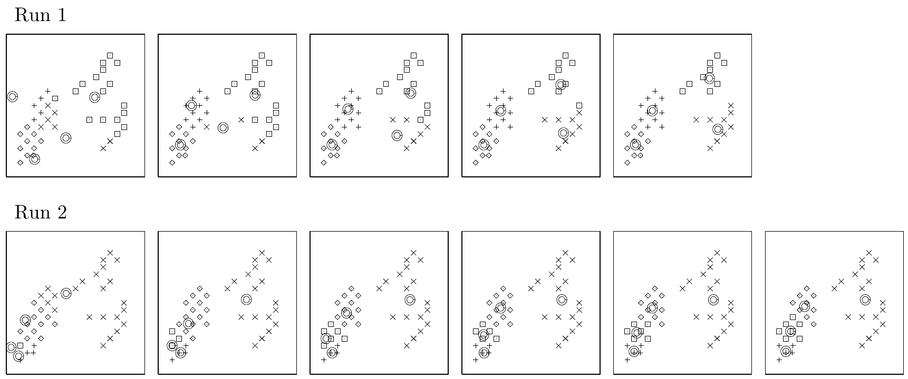

<!-- 源 PDF 物理页 299；原书印刷页 287。“关于这个算法的问题”末段跨到 PDF 300 页首，译文在此合为完整原段。 -->

图 20.3　K 均值算法应用于含 $40$ 个数据点的数据集。$K=2$ 个均值经过三轮迭代，到达稳定位置。图内 “Data”“Assignment”“Update” 分别为“数据”“分配”“更新”；下排按时间顺序展示三次分配及其后的更新。

图 20.4　K 均值算法应用于含 $40$ 个数据点的数据集。两次独立运行都采用 $K=4$ 个均值，却到达不同的解。每个小图显示一次接续的分配步骤。图内 “Run 1”“Run 2” 分别为“第 1 次运行”“第 2 次运行”。

习题 20.1（难度 4；解答见原书第 291 页）试证明 K 均值算法总会收敛。 [提示：寻找一个物理类比及其对应的李雅普诺夫函数。] [李雅普诺夫函数是算法状态的一个函数：只要状态改变，它就减小，而且它有下界。如果一个系统有李雅普诺夫函数，那么其动力学会收敛。]

图 20.4 演示了均值数目较多、即有 $4$ 个均值时的 K 均值算法。算法的结果取决于初始条件。第一种情况下，经过五次迭代后，数据点相当均匀地分到四个簇中，算法达到稳定状态。第二种情况下，经过六次迭代后，一半数据点落在同一个簇中，其余数据点则分布在另外三个簇里。

### *关于这个算法的问题*

K 均值算法有几个*人为设定*的特点。为什么更新步骤会把“均值”设为被分配数据点的平均值？距离 $d$ 从何而来？如果我们换一种方式度量 $\mathbf x$ 与 $\mathbf m$ 之间的距离，会怎样？怎样选择“最佳”距离？[在矢量量化问题中，距离函数作为问题定义的一部分给定；但这里假定我们关心的是数据建模，而不是矢量量化。]如何选择 $K$？给定 $K$ 后，如果找到了多个不同的聚类结果，又该如何从中挑选？
