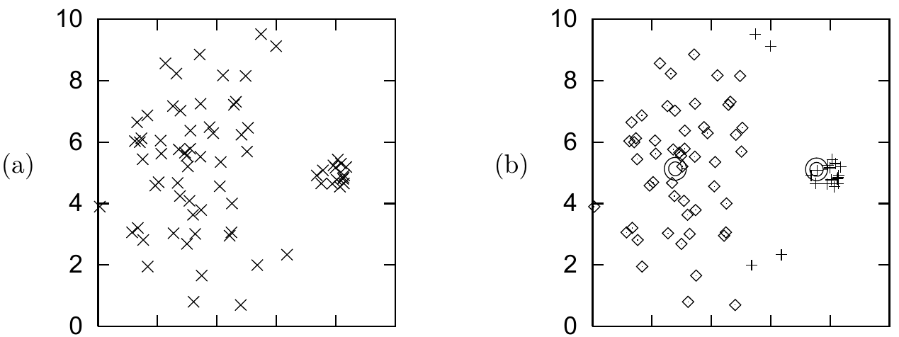
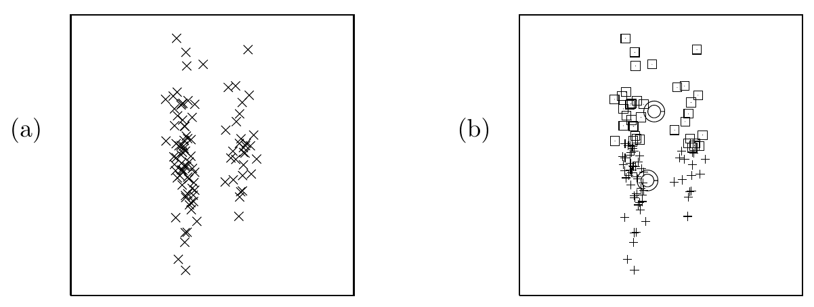

<!-- 源 PDF 物理页 300；原书印刷页 288。页首承接 PDF 299 的提问段，已合并于前页；末段跨 PDF 301 页首，译文在此合为整段。 -->

图 20.5　两个不相似的簇上的 K 均值算法。（a）“一小一大”的数据；（b）一组稳定的分配结果与均值。注意，原本属于较宽簇的四个点，被错误地分配给较窄的簇。（分配给右侧簇的点以加号表示。）

图 20.6　两个狭长的簇，以及 K 均值算法找到的稳定解。

### *K 均值可能被视为失败的情形*

考察算法表现不佳的情形（相对于普通人对“聚类”的理解），又会引出更多问题。图 20.5a 显示由两个高斯分布的混合生成的 $75$ 个数据点。右侧高斯分布的权重较小（只包含五分之一的数据点），其对应的簇也较窄。图 20.5b 显示使用 $K=2$ 个均值进行 K 均值聚类的结果。大簇中的四个数据点被分给小簇，两个均值最终都偏移到真实簇中心的左侧。K 均值算法只考虑均值与数据点之间的距离，无法表示簇的权重或宽度。因此，实际上属于宽簇的数据点被错误地分配给窄簇。

图 20.6 展示了 K 均值表现不佳的另一种情形。数据显然形成两个狭长的簇，但 K 均值算法唯一的稳定状态却是图 20.6b 所示的样子：两个簇被横切成两半！这两个例子说明，K 均值算法中的距离 $d$ 有些问题。K 均值算法无法表示簇的大小或形状。

对 K 均值的最后一项批评是：它是一种“硬”算法，而非“软”算法。每个点恰好分配给一个簇，且分配到同一簇的所有点在其中地位相同。位于两个或多个簇边界附近的点，可以说应该*在一定程度上*参与决定所有那些也可能接纳它们的簇的位置。但在 K 均值算法中，每个边界点都被塞进一个簇：它对该簇的位置拥有与簇内所有其他点同等的一票，对其他簇则完全没有发言权。
