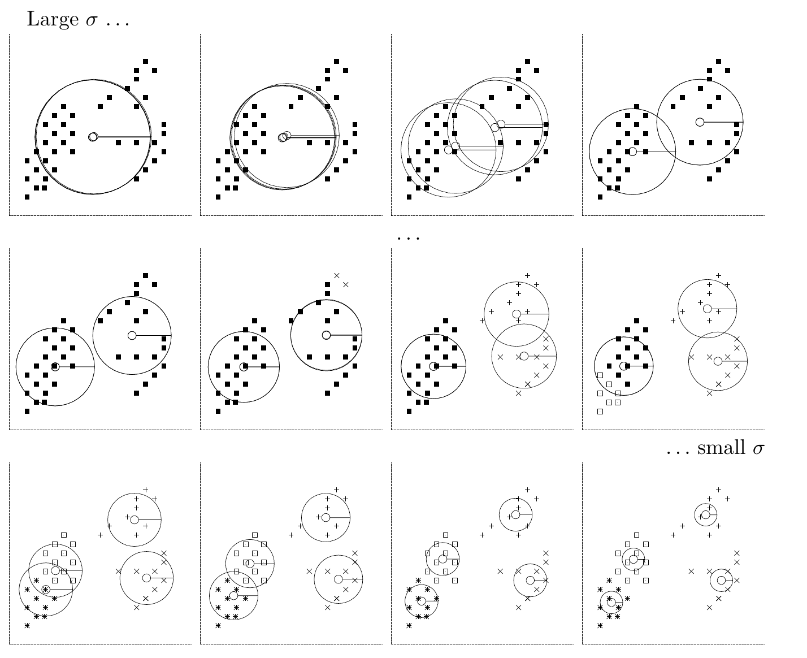
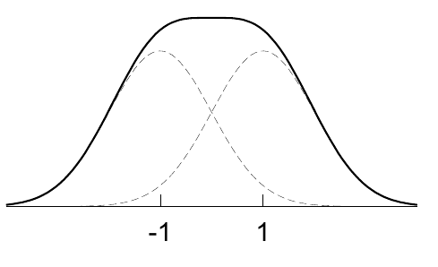

<!-- 源 PDF 物理页 302；原书印刷页 290。页首为 20.3 节首段续文，已合并于 PDF 301；习题 20.4 旁的无编号原书示意图单独保留。 -->

图 20.8　软 K 均值算法（版本 1）应用于含 $40$ 个数据点的数据集，$K=4$。隐含的长度尺度参数 $\sigma=1/\beta^{1/2}$ 从大值逐渐变到小值。每幅小图展示算法运行数十次迭代后，四个均值的状态；四个圆的半径表示隐含的长度尺度。在最大的长度尺度下，四个均值都精确收敛到数据的平均值。随后，四个均值分成两个各含两个均值的组。长度尺度进一步缩小时，这两组各自又分叉为更小的子组。图内 “Large $\sigma$ …” 和 “… small $\sigma$” 分别为“较大的 $\sigma$……”和“……较小的 $\sigma$”。

我们会在后面的章节回到这些问题，届时将从混合密度建模的角度展开聚类方法。

### 延伸阅读

关于以矢量量化方法进行聚类，可参见 Luttrell（1989；1990）。

## 20.4　习题

▷ 习题 20.3（难度 3；解答见原书第 291 页）假设数据点 $\{\mathbf x\}$ 来自*单个*可分离的二维高斯分布，均值为零，方差为 $(\operatorname{var}(x_1),\operatorname{var}(x_2))=(\sigma_1^2,\sigma_2^2)$，其中 $\sigma_1^2>\sigma_2^2$。设 $K=2$，并假设 $N$ 很大。研究当 $\beta$ 变化时，软 K 均值算法（版本 1）的不动点有哪些性质。[提示：假设 $\mathbf m^{(1)}=(m,0)$，$\mathbf m^{(2)}=(-m,0)$。]

▷ 习题 20.4（难度 3）考虑将软 K 均值算法应用于大量一维数据。这些数据来自两个等权重高斯分布的混合，两个分布的真实均值为 $\mu=\pm1$，标准差为 $\sigma_P$，例如 $\sigma_P=1$。证明：$K=2$ 的硬 K 均值算法给出的两个均值，比两个真实均值离得更远。讨论 $\beta$ 取其他值时会发生什么，并求出使软 K 均值算法把两个均值放在正确位置的 $\beta$ 值。

