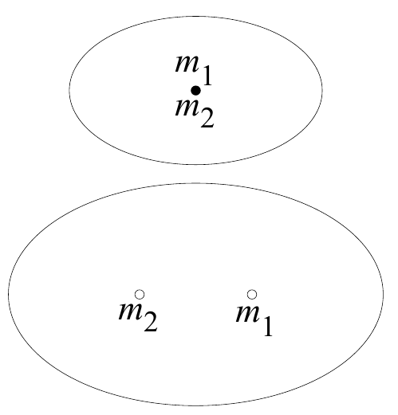
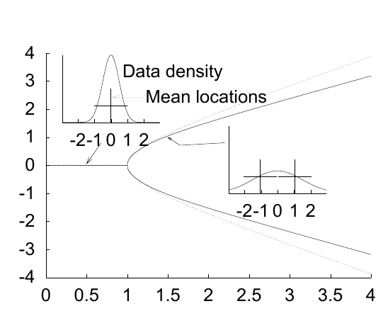
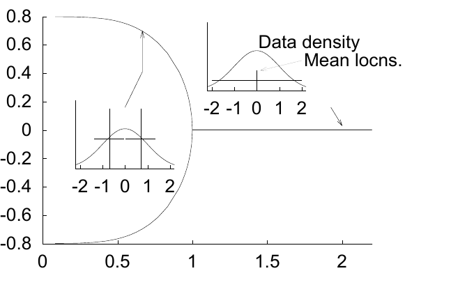

<!-- 源 PDF 物理页 303；原书印刷页 291。原书在“习题 20.3 的解答”首句把两个初始均值都印为 m^(1)：m^(1)=(m,0) 和 m^(1)=(-m,0)；习题 20.3 的提示却是 m^(1)、m^(2)。此处严格照录原页，未擅改第二个上标。 -->

## 20.5　解答

**习题 20.1 的解答（原书第 287 页）。** 可以在每个数据点 $\mathbf x^{(n)}$ 与负责它的均值之间连接一根弹簧，把 K 均值算法的状态与一种“能量”联系起来。一根弹簧的能量与其长度的平方成正比，即为 $\beta d(\mathbf x^{(n)},\mathbf m^{(k)})$，其中 $\beta$ 是弹簧的刚度。所有弹簧的总能量是该算法的一个*李雅普诺夫函数*，因为：（a）分配步骤只能降低能量——只有换一根更短的弹簧，数据点才会改变归属；（b）更新步骤只能降低能量——把 $\mathbf m^{(k)}$ 移到样本均值，正是使其所连弹簧的能量最小的做法；（c）能量有下界——这是李雅普诺夫函数的第二个条件。由于算法具有李雅普诺夫函数，它必然收敛。

图 20.9　当数据中最大的方差参数 $\sigma_1$ 从低于 $1/\beta^{1/2}$ 增至高于 $1/\beta^{1/2}$ 时，所发生分叉的示意图。数据方差以椭圆表示；图内 $m_1,m_2$ 标记两个均值的位置。

**习题 20.3 的解答（原书第 290 页）。** 如果均值初始化为 $\mathbf m^{(1)}=(m,0)$ 和 $\mathbf m^{(1)}=(-m,0)$，那么位于 $x_1,x_2$ 的数据点，在分配步骤中的责任度为

$$r_1(\mathbf x)=\frac{\exp[-\beta(x_1-m)^2/2]}{\exp[-\beta(x_1-m)^2/2]+\exp[-\beta(x_1+m)^2/2]},\tag{20.10}$$

$$=\frac{1}{1+\exp(-2\beta mx_1)},\tag{20.11}$$

更新后的 $m$ 为

$$m'=\frac{\int dx_1\,P(x_1)x_1r_1(\mathbf x)}{\int dx_1\,P(x_1)r_1(\mathbf x)},\tag{20.12}$$

$$=2\int dx_1\,P(x_1)x_1\frac{1}{1+\exp(-2\beta mx_1)}.\tag{20.13}$$

现在，$m=0$ 是一个不动点；问题在于它稳定还是不稳定。对于很小的 $m$（即 $\beta\sigma_1m\ll1$），可以作泰勒展开：

$$\frac{1}{1+\exp(-2\beta mx_1)}\simeq\frac12(1+\beta mx_1)+\cdots,\tag{20.14}$$

于是

$$m'\simeq\int dx_1\,P(x_1)x_1(1+\beta mx_1)\tag{20.15}$$

$$=\sigma_1^2\beta m.\tag{20.16}$$

当 $m$ 很小时，在这一映射下，它会指数增长或衰减，取决于 $\sigma_1^2\beta$ 是大于还是小于 $1$。不动点 $m=0$ 在以下条件下*稳定*：

$$\sigma_1^2\leq1/\beta,\tag{20.17}$$

否则就*不稳定*。[顺便指出，这一推导说明结论具有普遍性：只要真实概率分布 $P(x_1)$ 的方差为 $\sigma_1^2$，结论就成立，而不限于高斯分布。]

如果 $\sigma_1^2>1/\beta$，就会发生分叉，并在不稳定的不动点 $m=0$ 两侧出现两个稳定不动点。为了说明这种分叉，图 20.10 展示了对标准差 $\sigma_1$ 取不同值的一维数据运行软 K 均值算法的结果，其中 $\beta=1$。图 20.11 从另一个角度展示这一叉形分叉：固定数据的标准差 $\sigma_1$，让算法的长度尺度 $\sigma=1/\beta^{1/2}$ 在横轴上变化。

图 20.10　在固定 $\beta$ 下，稳定均值的位置随 $\sigma_1$ 的变化：粗线为数值结果，细线为近似式 (20.22)。图内 “Data density”“Mean locations” 分别为“数据密度”“均值位置”。

图 20.11　在固定 $\sigma_1$ 下，稳定均值的位置随 $1/\beta^{1/2}$ 的变化。图内 “Data density”“Mean locns.” 分别为“数据密度”“均值位置”。
