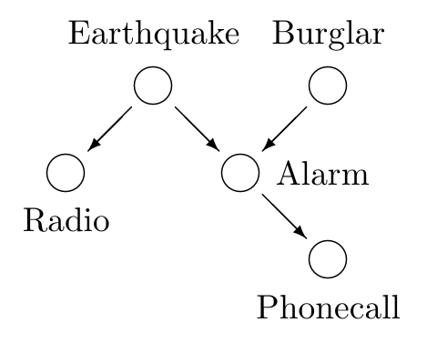

<!-- 源 PDF 物理页 305；原书印刷页 293。列表第 2 项的说明接续 PDF 306 页首。 -->

# 第 21 章　通过完全枚举进行精确推断

> **编者导读（非原书正文）**　本章从防盗警报和高斯模型出发，展示如何枚举假设来计算后验概率，以及参数网格变大后这种精确方法面临的计算代价。

我们打开处理概率问题的方法工具箱，先讨论一种蛮力推断方法：完全枚举所有假设，并计算它们各自的概率。这是一种精确方法；实际执行它的困难，将促使我们在后续章节引入更巧妙的精确方法和近似方法。

## 21.1　防盗警报器

贝叶斯概率论有时被称为“放大版的常识”。思考以下问题时，请先问问常识会给出什么答案；然后我们会看到，贝叶斯方法如何证实你的日常直觉。

**例 21.1。** 弗雷德住在洛杉矶，每天通勤 $60$ 英里去上班。工作时，他接到邻居的电话，说他家的防盗警报器响了。今天他家有盗贼的概率是多少？弗雷德开车回家查看时，从广播中得知，当天他家附近发生了一次小地震。“哦，”他松了口气说，“大概是地震触发了警报。”那么，他家有盗贼的概率现在是多少？（据 Pearl，1988。）

图 21.1　防盗警报问题的信念网络。图内 “Earthquake”“Burglar”“Radio”“Alarm”“Phonecall” 分别为“地震”“盗贼”“广播”“警报”“电话通知”。

引入以下变量：$b$（今天弗雷德家中有盗贼）、$a$（警报器正在响）、$p$（弗雷德接到邻居报告警报的电话）、$e$（今天弗雷德家附近发生小地震）、$r$（弗雷德听到广播中的地震报道）。这些变量的联合概率可能分解为

$$P(b,e,a,p,r)=P(b)P(e)P(a\mid b,e)P(p\mid a)P(r\mid e),\tag{21.1}$$

这些概率可取以下合理的数值：

1. **入室盗窃概率：**

$$P(b=1)=\beta,\quad P(b=0)=1-\beta,\tag{21.2}$$

例如，$\beta=0.001$ 对应的平均入室盗窃率约为每三年一次。

2. **地震概率：**

$$P(e=1)=\epsilon,\quad P(e=0)=1-\epsilon,\tag{21.3}$$
