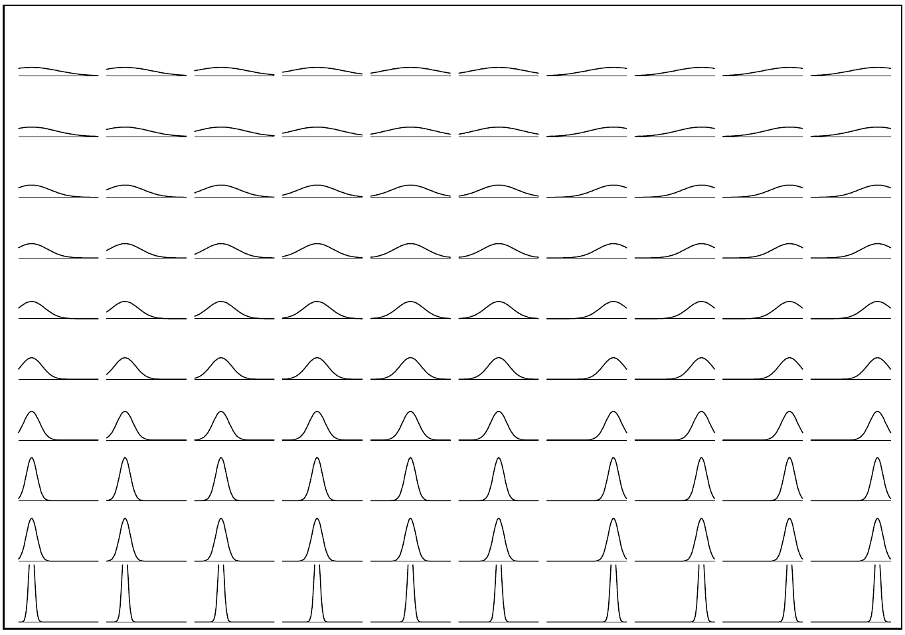
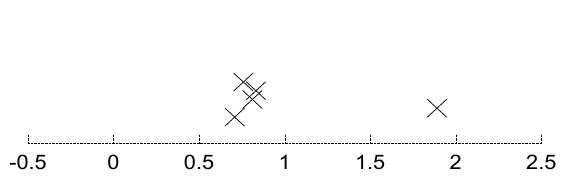

<!-- 源 PDF 物理页 308；原书印刷页 296。页首接续 PDF 307 的句子已并入上一页；页末跨图页 309 至 PDF 310 的句子在本页译全。 -->

图 21.2　对单个高斯分布的整个（离散化的）假设空间进行枚举，参数为 $\mu$（水平方向）和 $\sigma$（竖直方向）。

### *双参数模型*

以高斯分布为例，考察一个具有二维假设空间的模型。一维高斯分布由均值 $\mu$ 和标准差 $\sigma$ 参数化：

$$P(x\mid\mu,\sigma)=\frac{1}{\sqrt{2\pi}\sigma}\exp\!\left(-\frac{(x-\mu)^2}{2\sigma^2}\right)\equiv\operatorname{Normal}(x;\mu,\sigma^2).\tag{21.8}$$

图 21.3　五个数据点 $\{x_n\}_{n=1}^{5}$。横坐标是数据值 $x_n$；纵坐标没有意义。

图 21.2 枚举了关于一维高斯分布的均值与标准差的 $100$ 个假设。这些假设均匀排列在一个 $10\times10$ 的方形网格上，覆盖 $\mu$ 的 $10$ 个值和 $\sigma$ 的 $10$ 个值。每个假设都用一幅图表示，图中显示它赋予 $x$ 的概率密度。现在，我们根据假定从这一密度中独立抽取的数据点 $x_n$（$n=1,\ldots,N$），来推断 $\mu$ 和 $\sigma$。

设想我们获得了一组数据，例如图 21.3 所示的五个点。现在，可以通过计算这 $100$ 个子假设各自的似然，即 $P(\{x_n\}_{n=1}^{5}\mid\mu,\sigma)$ 的值，来评估每个子假设的后验概率。图 21.4 用线条粗细示意似然值；似然低于最大似然的 $e^{-8}$ 倍的子假设已被删去。

使用更密的网格，就可以将同一信息表示为似然关于 $\mu$ 和 $\sigma$ 的曲面图或等高线图（图 21.5）。

### *五参数混合模型*

目测这些数据（图 21.3），你也许会同意：与其认为它们来自单个高斯分布，不如认为它们来自两个高斯分布的混合，这似乎更合理。该混合分布由两个均值、两个标准差和两个混合系数 $\pi_1,\pi_2$ 定义，且满足 $\pi_1+\pi_2=1$、$\pi_i\geq0$。
