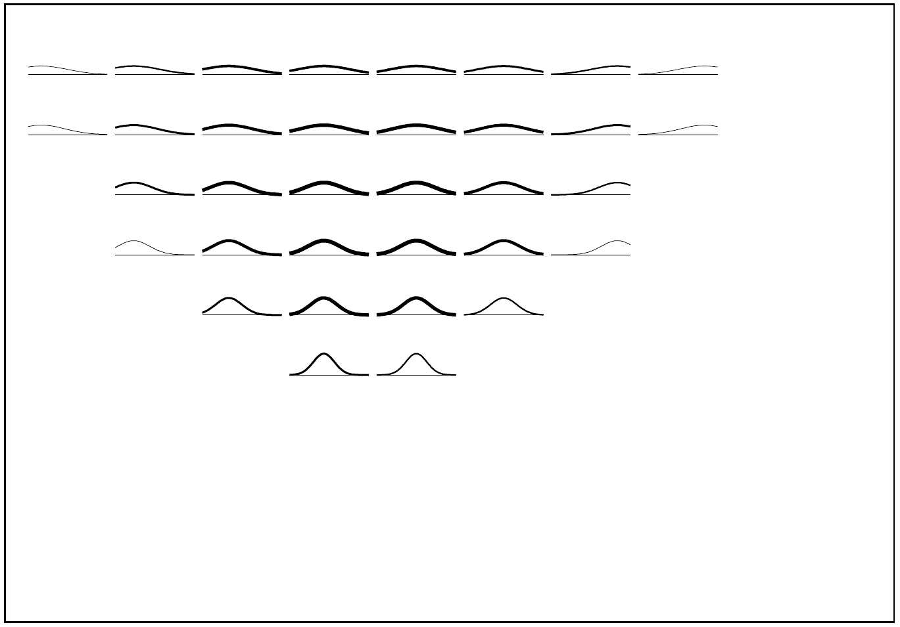
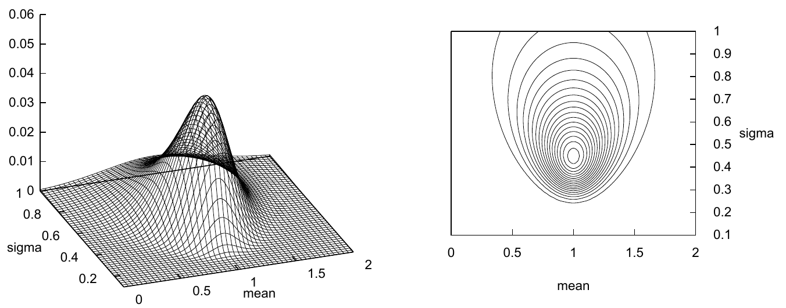

<!-- 源 PDF 物理页 309；原书印刷页 297。原页仅有图 21.4、图 21.5 及图注，没有正文或公式。 -->

图 21.4　给定图 21.3 中的数据，用线条粗细表示似然函数。似然小于最大似然的 $e^{-8}$ 倍的子假设没有显示。

图 21.5　高斯分布参数的似然函数。图中给出对数似然关于 $\mu$ 和 $\sigma$ 的曲面图与等高线图。$N=5$ 个数据点的样本均值为 $\bar{x}=1.0$，且 $S=\sum(x-\bar{x})^2=1.0$。图内 “mean” 为“均值”， “sigma” 为“标准差”。
