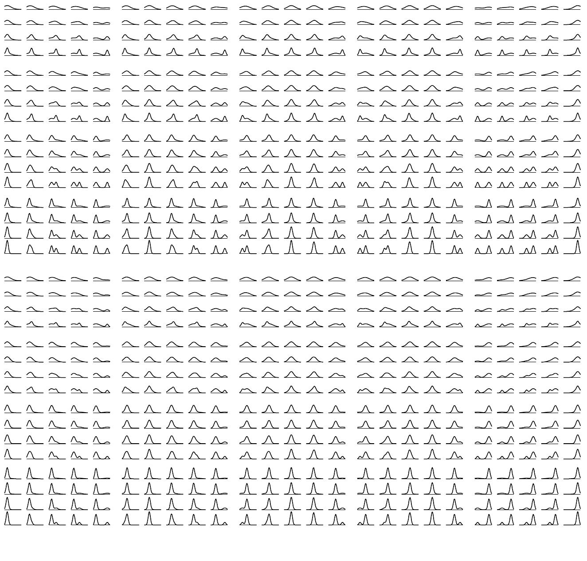

<!-- 源 PDF 物理页 310；原书印刷页 298。页首接续 PDF 308（中间为 PDF 309 图页）的句子已并入 PDF 308；页末跨 PDF 311 的句子在本页译全。 -->

图 21.6　枚举两个高斯分布所构成混合模型的整个（离散化的）假设空间。上半部分的混合权重为 $\pi_1,\pi_2=0.6,0.4$，下半部分为 $0.8,0.2$。均值 $\mu_1,\mu_2$ 沿水平方向变化，标准差 $\sigma_1,\sigma_2$ 沿竖直方向变化。

$$P(x\mid\mu_1,\sigma_1,\pi_1,\mu_2,\sigma_2,\pi_2)=\frac{\pi_1}{\sqrt{2\pi}\sigma_1}\exp\!\left(-\frac{(x-\mu_1)^2}{2\sigma_1^2}\right)+\frac{\pi_2}{\sqrt{2\pi}\sigma_2}\exp\!\left(-\frac{(x-\mu_2)^2}{2\sigma_2^2}\right).$$

来枚举这一替代模型的子假设吧。参数空间有五维，因此很难在一页纸上表现出来。图 21.6 枚举了五个参数 $\mu_1,\mu_2,\sigma_1,\sigma_2,\pi_1$ 取不同值时的 $800$ 个子假设。两个均值沿水平方向各取五个值；两个标准差沿竖直方向各取四个值；$\pi_1$ 则沿竖直方向取两个值。根据五个数据点对这五个参数所作的推断，可以按图 21.7 表示。

如果想比较单高斯模型与双高斯混合模型，可以计算每个模型 $\mathcal H$ 的边缘似然或证据 $P(\{x\}\mid\mathcal H)$，从而得到各模型的后验概率。证据由对参数 $\boldsymbol\theta$ 积分得到；数值实现时，可以对枚举出的各个 $\boldsymbol\theta$ 值求和：

$$P(\{x\}\mid\mathcal H)=\sum_{\boldsymbol\theta}P(\boldsymbol\theta)P(\{x\}\mid\boldsymbol\theta,\mathcal H),\tag{21.9}$$

其中 $P(\boldsymbol\theta)$ 是参数网格上的先验分布，这里取为均匀分布。

对于双高斯混合分布，这个积分是五维积分。要使计算达到一定精度，就需要比图中所示密得多的网格。假如观察数据后，$K$ 个参数中每个参数的不确定范围都缩小了十倍，那么用蛮力法积分至少需要包含 $10^K$ 个点的网格。计算量随模型规模指数增长，这正是完全枚举很少能成为可行计算策略的原因。
