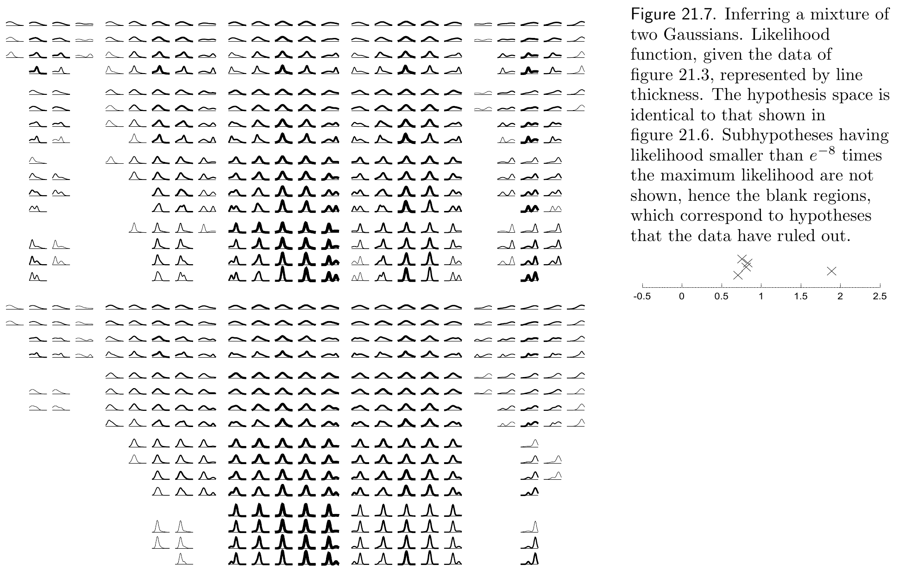

<!-- 源 PDF 物理页 311；原书印刷页 299。页首接续 PDF 310 的句子已并入上一页。图 21.7 裁切同时保留右侧原书英文图注和数据点小图，中文图注如下。 -->

图 21.7　推断两个高斯分布的混合。给定图 21.3 的数据，用线条粗细表示似然函数。假设空间与图 21.6 完全相同。似然小于最大似然的 $e^{-8}$ 倍的子假设没有显示，所以图中出现空白区域；它们对应数据已经排除的假设。右侧小图再次示出图 21.3 的五个数据点，横坐标为数据值，纵坐标没有意义。

 **习题 21.3**（难度 1）设想用十个高斯分布的混合模型，拟合二十维空间中的数据。请估计通过枚举参数值网格来实现该模型推断的计算成本。
