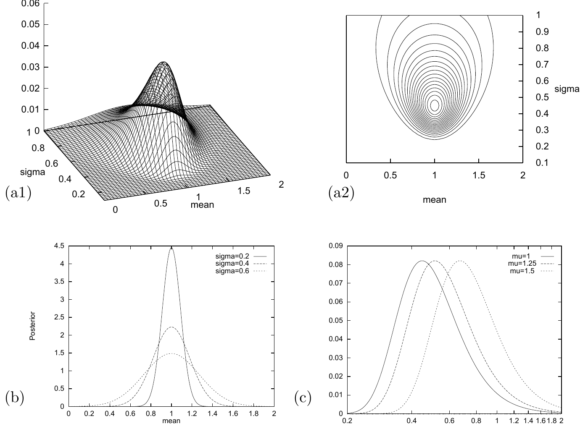

<!-- 源 PDF 物理页 313；原书印刷页 301。页末方括号说明跨 PDF 314，在本页译全。 -->

图 22.1　高斯分布参数的似然函数。（a1、a2）对数似然关于 $\mu$ 和 $\sigma$ 的曲面图与等高线图。$N=5$ 个数据点的均值为 $\bar{x}=1.0$，且 $S=\sum(x-\bar{x})^2=1.0$。（b）在 $\sigma$ 取不同值时，$\mu$ 的后验概率。（c）在 $\mu$ 取不同固定值时，$\sigma$ 的后验概率（以 $\ln\sigma$ 上的密度表示）。图内 “mean”“sigma”“Posterior” 分别为“均值”“标准差”“后验概率”；曲线标记 $\sigma=0.2,0.4,0.6$ 与 $\mu=1,1.25,1.5$ 表示各曲线所用参数值。

如果在最大值附近对对数似然作泰勒展开，就可以为最大似然参数定义近似误差棒：用二次近似估计参数取值能偏离最大似然点多远，才会使似然下降一个标准倍数，例如 $e^{1/2}$ 或 $e^{4/2}$ 倍。若似然恰好是参数的高斯函数，则二次近似是精确的。

**例 22.2。** 给定数据与 $\sigma$，求对数似然对 $\mu$ 的二阶导数，以及 $\mu$ 的误差棒。

**解答。**

$$\frac{\partial^2}{\partial\mu^2}\ln P=-\frac{N}{\sigma^2}.\qquad\square\tag{22.7}$$

将这一曲率与标准差为 $\sigma_\mu$ 的 $\mu$ 上高斯分布的对数曲率相比较；该高斯分布为 $\exp(-\mu^2/(2\sigma_\mu^2))$，其对数曲率是 $-1/\sigma_\mu^2$。由此可得，$\mu$ 的误差棒（由似然函数导出）为

$$\sigma_\mu=\frac{\sigma}{\sqrt N}.\tag{22.8}$$

这些误差棒具有以下性质：在 $\mu=\bar{x}\pm\sigma_\mu$ 两点，似然比最大值小 $e^{1/2}$ 倍。

**例 22.3。** 已知某高斯分布的均值为 $\mu$。给定数据 $\{x_n\}_{n=1}^{N}$，求最大似然标准差 $\sigma$；再求对数似然对 $\ln\sigma$ 的二阶导数，以及 $\ln\sigma$ 的误差棒。

**解答。** 似然对 $\sigma$ 的依赖为

$$\ln P(\{x_n\}_{n=1}^{N}\mid\mu,\sigma)=-N\ln(\sqrt{2\pi}\sigma)-\frac{S_{\mathrm{tot}}}{2\sigma^2},\tag{22.9}$$

其中 $S_{\mathrm{tot}}=\sum_n(x_n-\mu)^2$。为求似然的最大值，可以对 $\ln\sigma$ 求导。[当 $u$ 是尺度变量时，对 $\ln u$ 而不是 $u$ 求导通常最省事；我们用到 $\mathrm d u^n/\mathrm d(\ln u)=nu^n$。]
