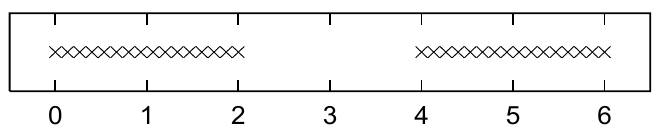

<!-- 源 PDF 物理页 315；原书印刷页 303。页首接续习题 22.5；页末跨 PDF 316 图页至 PDF 317 的句子在本页译全。 -->

现在假设均值 $\{\mu_k\}$ *未知*，希望从数据 $\{x_n\}_{n=1}^{N}$ 推断它们。（标准差 $\sigma$ 已知。）本题余下部分将推导一个迭代算法，寻找使似然达到最大值的 $\{\mu_k\}$：

$$P(\{x_n\}_{n=1}^{N}\mid\{\mu_k\},\sigma)=\prod_nP(x_n\mid\{\mu_k\},\sigma).\tag{22.18}$$

令 $L$ 表示似然的自然对数。证明，对数似然关于 $\mu_k$ 的导数为

$$\frac{\partial L}{\partial\mu_k}=\sum_n p_{k\mid n}\frac{x_n-\mu_k}{\sigma^2},\tag{22.19}$$

其中 $p_{k\mid n}\equiv P(k_n=k\mid x_n,\boldsymbol\theta)$ 已在式 (22.17) 上方出现。

忽略 $\frac{\partial}{\partial\mu_k}P(k_n=k\mid x_n,\boldsymbol\theta)$ 中的项，证明二阶导数近似为

$$\frac{\partial^2 L}{\partial\mu_k^2}=-\sum_n p_{k\mid n}\frac{1}{\sigma^2}.\tag{22.20}$$

由此证明，从初始状态 $\mu_1,\mu_2$ 出发，近似的牛顿—拉夫森步骤将参数更新为 $\mu'_1,\mu'_2$，其中

$$\mu'_k=\frac{\sum_n p_{k\mid n}x_n}{\sum_n p_{k\mid n}}.\tag{22.21}$$

[牛顿—拉夫森法通过 $\mu'=\mu-\left(\frac{\partial L}{\partial\mu}\middle/\frac{\partial^2L}{\partial\mu^2}\right)$ 更新 $\mu$，使 $L(\mu)$ 达到最大。]

假设 $\sigma=1$，请为上图所示数据集画出似然函数关于 $\mu_1$ 和 $\mu_2$ 的等高线图。数据集包含 $32$ 个点。描述草图中的各个峰，并标出它们的宽度。

注意，你推导出的最大似然算法与第 20.4 节的软 K 均值算法相同。既然聚类可以视为混合密度建模，我们就能进一步改进 K 均值算法，以纠正前面指出的问题。

## 22.3　软 K 均值算法的改进

算法 22.2 给出软 K 均值算法的一个版本，它对应的建模假设是：每个簇都是球形高斯分布，且各有自己的宽度（每个簇都有自己的 $\beta^{(k)}=1/\sigma_k^2$）。算法会自行更新各簇的长度尺度 $\sigma_k$。它还包含簇权重参数 $\pi_1,\pi_2,\ldots,\pi_K$，这些参数也会自行更新，从而准确地为权重不等的各个簇的数据建模。图 22.3 用我们先前看过的两个数据集演示这一算法。第二个例子表明，收敛可能需要很长时间，但算法最终能识别出小簇和大簇。
