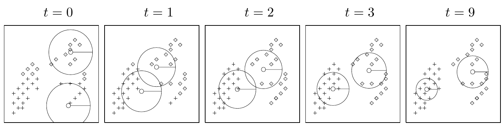
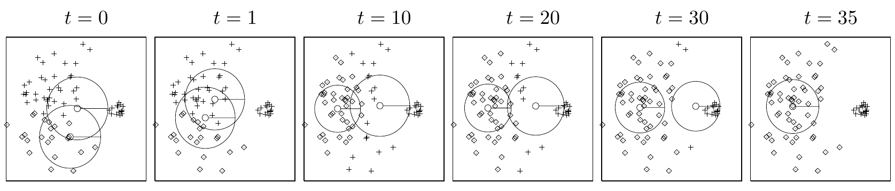

<!-- 源 PDF 物理页 316；原书印刷页 304。本页为算法 22.2、图 22.3、算法 22.4；没有章正文段落。原书式 (22.22) 分母在求和 k' 下仍印 π_k，疑为原书笔误，此处照录。 -->

**分配步骤。** 责任度为

$$r_k^{(n)}=\frac{\displaystyle\pi_k\frac{1}{(\sqrt{2\pi}\sigma_k)^I}\exp\!\left(-\frac{1}{\sigma_k^2}d(\mathbf m^{(k)},\mathbf x^{(n)})\right)}{\displaystyle\sum_{k'}\pi_k\frac{1}{(\sqrt{2\pi}\sigma_{k'})^I}\exp\!\left(-\frac{1}{\sigma_{k'}^2}d(\mathbf m^{(k')},\mathbf x^{(n)})\right)}.\tag{22.22}$$

其中 $I$ 是 $\mathbf x$ 的维数。

**更新步骤。** 调整每个簇的参数 $\mathbf m^{(k)}$、$\pi_k$ 和 $\sigma_k^2$，使之与该簇负责的数据点相匹配。

$$\mathbf m^{(k)}=\frac{\sum_n r_k^{(n)}\mathbf x^{(n)}}{R^{(k)}}.\tag{22.23}$$

$$\sigma_k^2=\frac{\sum_n r_k^{(n)}(\mathbf x^{(n)}-\mathbf m^{(k)})^2}{I R^{(k)}}.\tag{22.24}$$

$$\pi_k=\frac{R^{(k)}}{\sum_k R^{(k)}}.\tag{22.25}$$

其中 $R^{(k)}$ 是均值 $k$ 的总责任度，

$$R^{(k)}=\sum_n r_k^{(n)}.\tag{22.26}$$

算法 22.2　软 K 均值算法，版本 2。

图 22.3　软 K 均值算法，$K=2$。（a）应用于图 20.3 的 $40$ 点数据集；（b）应用于图 20.5 的小“n”大数据集。图中 $t$ 表示迭代次数；（a）依次为 $t=0,1,2,3,9$，（b）依次为 $t=0,1,10,20,30,35$。

$$r_k^{(n)}=\frac{\displaystyle\pi_k\frac{1}{\prod_{i=1}^{I}\sqrt{2\pi}\sigma_i^{(k)}}\exp\!\left(-\sum_{i=1}^{I}\frac{(m_i^{(k)}-x_i^{(n)})^2}{2(\sigma_i^{(k)})^2}\right)}{\displaystyle\sum_{k'}\bigl(\text{分子式，其中 }k'\text{ 取代 }k\bigr)}.\tag{22.27}$$

$$\sigma_i^{2(k)}=\frac{\sum_n r_k^{(n)}(x_i^{(n)}-m_i^{(k)})^2}{R^{(k)}}.\tag{22.28}$$

算法 22.4　软 K 均值算法，版本 3；对应于轴对齐高斯分布模型。
