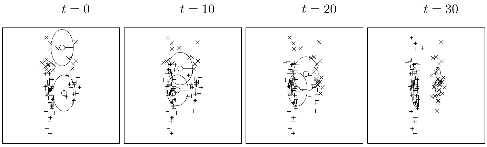
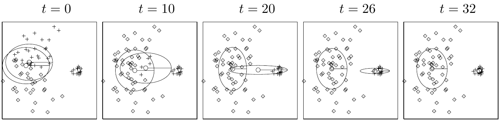
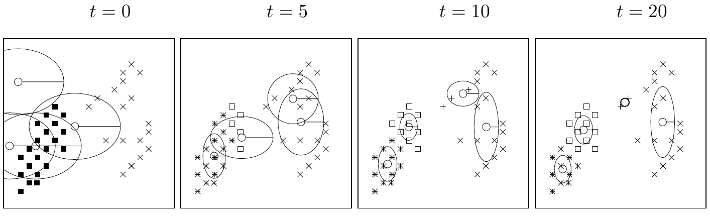

<!-- 源 PDF 物理页 317；原书印刷页 305。页首接续 PDF 315（中间为算法与图页 PDF 316）的末句已并入 PDF 315。本页有图 22.5–22.7、页边说明、习题 22.6，无编号公式。 -->

图 22.5　软 K 均值算法版本 3 应用于由两个雪茄形簇组成的数据集，$K=2$（参见图 20.6）。图内 $t=0,10,20,30$ 为迭代次数。

图 22.6　软 K 均值算法版本 3 应用于小“n”大数据集，$K=2$。图内 $t=0,10,20,26,32$ 为迭代次数。

软 K 均值算法版本 2 是一种最大似然算法，用于将*球形高斯分布*的混合模型拟合到数据上；“球形”是指高斯分布在所有方向上的方差相同。但这一算法仍不能很好地为图 20.6 的雪茄形簇建模。若要用方差可以不相等的轴对齐高斯分布来表示这些簇，就把分配规则式 (22.22) 和方差更新规则式 (22.24) 换成算法 22.4 中的式 (22.27) 与式 (22.28)。

> **页边说明：** 关于该算法确实使似然最大化的证明，留待第 33.7 节。

软 K 均值算法的第三个版本在图 22.5 中用于图 20.6 的“双雪茄”数据集。迭代 $30$ 次后，算法正确找到了两个簇。图 22.6 展示同一算法用于小“n”大数据集；同样，它也找到了正确的簇位置。

## 22.4　最大似然的致命缺陷

最后，图 22.7 发出一个警示：用 $K=4$ 个均值拟合第一个玩具数据集时，有时会形成极小的簇，只覆盖一两个数据点。这是软 K 均值聚类版本 2 和版本 3 的一种病态性质。

▷ **习题 22.6**（难度 2）考察一个均值 $\mathbf m^{(k)}$ 恰好落在某个数据点上时会发生什么；证明若方差 $\sigma_k^2$ 足够小，就无法再回头：$\sigma_k^2$ 会越来越小。

图 22.7　软 K 均值算法应用于包含 $40$ 个点的数据集，$K=4$。请注意，收敛时，两个数据点之间形成了一个极小的簇。图内 $t=0,5,10,20$ 为迭代次数。
